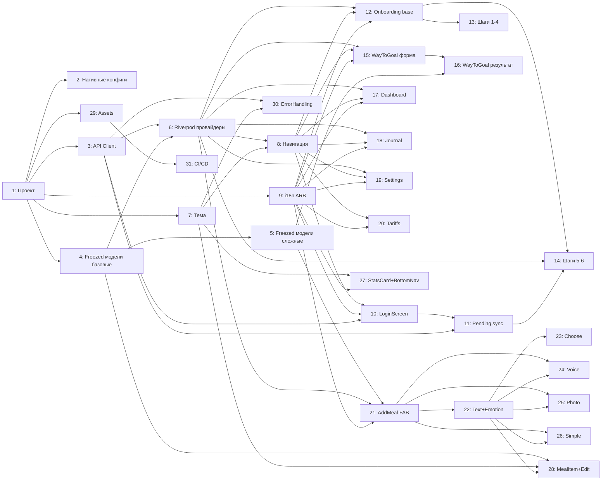

# Декомпозиция задач — Flutter Kayfit

> Основание: tz_kayfit_flutter.md + flutter-architecture.md
> Дата: 2026-03-05
> Версия: 1.0

---

## Легенда

- **ВАЙБКОДИНГ** — стандартная работа: CRUD, формы, UI по спеке. Можно делать с AI-помощником без экспертизы.
- **ПРО-РАЗРАБОТЧИК** — требует экспертизы: безопасность, нативные API, сложная логика состояний.
- **P0** — блокирует всё остальное (инфраструктура)
- **P1** — критичный функционал (MVP)
- **P2** — вторичный функционал

---

## Этап 0 — Инициализация проекта

### Задача 1: Создание Flutter проекта и структуры папок
**Тип:** ВАЙБКОДИНГ
**Приоритет:** P0
**Зависит от:** нет
**Файлы:**
- `pubspec.yaml`
- `lib/main.dart`
- `lib/app.dart`
- `lib/router.dart` (пустой скелет)
- `lib/core/api/` (пустые папки)
- `lib/core/auth/` (пустые папки)
- `lib/core/i18n/` (пустые папки)
- `lib/features/` (все подпапки по фичам)
- `lib/shared/widgets/` + `lib/shared/models/`
- `.gitignore`

**Описание:**
1. `flutter create kayfit --org ru.kayfit --platforms ios,android`
2. Добавить все зависимости в `pubspec.yaml` согласно HLD: go_router, flutter_riverpod, riverpod_annotation, dio, dio_cookie_manager, cookie_jar, google_sign_in, sign_in_with_apple, app_links, freezed_annotation, json_annotation, flutter_localizations, intl, webview_flutter, image_picker, record, permission_handler, shared_preferences, fl_chart
3. Добавить dev_dependencies: build_runner, freezed, json_serializable, riverpod_generator
4. Создать полную структуру папок согласно HLD (пустые файлы с заглушками `// TODO`)
5. Настроить `l10n.yaml` для flutter_localizations (`arb-dir: lib/core/i18n`, `template-arb-file: app_ru.arb`)

**Definition of Done:**
- `flutter pub get` проходит без ошибок
- `flutter analyze` без критических ошибок
- Структура папок соответствует HLD
- `pubspec.yaml` содержит все нужные зависимости с указанными версиями

---

### Задача 2: Конфигурация нативных платформ (iOS + Android)
**Тип:** ПРО-РАЗРАБОТЧИК
**Приоритет:** P0
**Зависит от:** Задача 1
**Файлы:**
- `ios/Runner/Info.plist`
- `android/app/src/main/AndroidManifest.xml`
- `android/app/build.gradle`
- `ios/Runner.xcodeproj/project.pbxproj` (через xcode)

**Описание:**
1. **iOS Info.plist** — добавить:
   - `NSCameraUsageDescription` — "Для распознавания еды на фото"
   - `NSPhotoLibraryUsageDescription` — "Для добавления фото еды"
   - `NSMicrophoneUsageDescription` — "Для голосового ввода"
   - `CFBundleURLSchemes` — `["kayfit"]` (deep links Telegram)
   - `LSApplicationQueriesSchemes` — `["tg"]` (открыть Telegram)
2. **AndroidManifest.xml** — добавить:
   - `android.permission.CAMERA`
   - `android.permission.RECORD_AUDIO`
   - `android.permission.INTERNET`
   - Intent-filter для `kayfit://` deep links (scheme=kayfit, host=auth)
3. **Android minSdkVersion** — установить 21 (требование record и sign_in_with_apple не нужен на Android)
4. **Google Sign-In** — добавить `google-services.json` (Android) и `GoogleService-Info.plist` (iOS) — файлы получить из Firebase Console проекта Kayfit (или создать новый)
5. Настроить `apple_sign_in` bundle identifier в Xcode — Capabilities → Sign In with Apple

**Definition of Done:**
- Приложение запускается на симуляторе iOS и эмуляторе Android без crash
- Deep link `kayfit://auth?token=test` перехватывается приложением (проверить через `adb shell am start`)
- Запрос разрешений на камеру и микрофон работают

---

## Этап 1 — Ядро (core)

### Задача 3: API Client (Dio + CookieJar + interceptors)
**Тип:** ПРО-РАЗРАБОТЧИК
**Приоритет:** P0
**Зависит от:** Задача 1
**Файлы:**
- `lib/core/api/api_client.dart`
- `lib/core/api/api_endpoints.dart`
- `lib/core/auth/auth_interceptor.dart`

**Описание:**
Реализовать `ApiClient` — singleton-обёртка над Dio:

1. **`api_endpoints.dart`** — константы всех URL (23 эндпоинта из ТЗ):
   ```dart
   class ApiEndpoints {
     static const baseUrl = 'https://api.kayfit.ru';
     static const stats = '/api/stats';
     static const goals = '/api/goals';
     static const meals = '/api/meals';
     // ... все 23 пути
   }
   ```

2. **`api_client.dart`** — Dio с `PersistCookieJar`:
   - `PersistCookieJar` с хранилищем в `getApplicationDocumentsDirectory()/cookies/`
   - `CookieManager(cookieJar)` подключён через `dio.interceptors`
   - Таймауты: connectTimeout=10s, receiveTimeout=30s (для AI-запросов)
   - Метод `clearCookies()` для logout

3. **`auth_interceptor.dart`** — `InterceptorsWrapper.onError`:
   - При statusCode == 401 И path != `/api/profile`: очистить cookieJar, `ref.invalidate(currentUserProvider)`
   - При statusCode == 401 И path == `/api/profile`: НЕ redirect (возвращает null в провайдере)
   - При DioExceptionType.connectionError/connectionTimeout: пробросить с понятным сообщением

4. Экспортировать `apiClientProvider` как `Provider<ApiClient>` (Riverpod, `@riverpod`)

**Definition of Done:**
- `GET https://api.kayfit.ru/api/stats` выполняется и возвращает данные (тест на реальном устройстве)
- Cookie сохраняется после ответа и передаётся в следующем запросе
- При 401 происходит redirect на onboarding (кроме `/api/profile`)
- `flutter analyze` чистый

---

### Задача 4: Freezed модели (Meal, Goals, Stats, UserProfile)
**Тип:** ВАЙБКОДИНГ
**Приоритет:** P0
**Зависит от:** Задача 1
**Файлы:**
- `lib/shared/models/meal.dart`
- `lib/shared/models/goals.dart`
- `lib/shared/models/stats.dart`
- `lib/shared/models/user_profile.dart`

**Описание:**
Реализовать 4 Freezed-модели точно по спецификации раздела 4 ТЗ:

1. **`Meal`** — `id, name, calories, protein, fat, carbs, emotion, time`. Все поля обязательны, `emotion` default `''`.
2. **`Goals`** — `calories, protein, fat, carbs` (int). `fromJson` + `toJson`.
3. **`MacroStat`** + **`Stats`** — `MacroStat(current, goal, percent)` вложен в `Stats(calories, protein, fat, carbs, compulsiveCount)`. `@JsonKey(name: 'compulsive_count')` для `compulsiveCount`.
4. **`UserProfile`** — все поля nullable кроме `onboardingCompleted` (default false). `@JsonKey` для snake_case полей: `training_days`, `current_weight`, `target_weight`, `onboarding_completed`.

После каждого файла запускать `dart run build_runner build --delete-conflicting-outputs`.

**Definition of Done:**
- `dart run build_runner build` завершается без ошибок
- Все `.freezed.dart` и `.g.dart` файлы сгенерированы
- Юнит-тест: `Meal.fromJson({'id': 1, 'name': 'Курица', ...})` не бросает исключение
- `meal.toJson()` возвращает корректный Map

---

### Задача 5: Freezed модели (CalculationResult, MealSuggestion, OnboardingState, AddMealState)
**Тип:** ВАЙБКОДИНГ
**Приоритет:** P1
**Зависит от:** Задача 4
**Файлы:**
- `lib/shared/models/calculation_result.dart`
- `lib/features/add_meal/models/meal_suggestion.dart`
- `lib/features/onboarding/models/onboarding_state.dart`
- `lib/features/add_meal/models/add_meal_state.dart`

**Описание:**
1. **`CalculationResult`** — `bmr, tdee, targetCalories, protein, fat, carbs, daysToGoal?, targetWeight?, chartData?`. `ChartPoint(date, weight)` — вложенный класс. `@JsonKey` для snake_case.
2. **`MealSuggestion`** + `PerPiece` + `ParsedItem` — согласно разделу 4.6 ТЗ.
3. **`OnboardingState`** — `currentStep(default:1), trainingDays(default:[]), rewards(default:[])`. БЕЗ `fromJson/toJson` (только в памяти).
4. **`AddMealState`** — `step, pendingText, emotion, parsedItems, selections, isLoading, error, stepBeforeEmotion`. Enum `AddMealStep { method, input, recording, transcribing, emotion, choose, simple }`.

**Definition of Done:**
- `build_runner build` без ошибок
- Все вложенные классы (ChartPoint, PerPiece, ParsedItem) генерируются корректно

---

### Задача 6: Riverpod провайдеры данных (8 провайдеров)
**Тип:** ВАЙБКОДИНГ
**Приоритет:** P0
**Зависит от:** Задача 3, Задача 4
**Файлы:**
- `lib/core/auth/auth_provider.dart`
- `lib/features/dashboard/providers/dashboard_provider.dart`
- `lib/features/journal/providers/journal_provider.dart`
- `lib/features/settings/providers/settings_provider.dart`
- `lib/features/way_to_goal/providers/way_to_goal_provider.dart`

**Описание:**
Реализовать 8 FutureProvider из раздела 5 ТЗ:

1. **`currentUserProvider`** — `GET /api/profile`, при 401 возвращает `null` (без exception). Используется как auth-индикатор.
2. **`dailyGoalsProvider`** — `GET /api/goals`, при ошибке сети — дефолт `Goals(2000, 180, 60, 180)`.
3. **`todayStatsProvider`** — `GET /api/stats`.
4. **`todayMealsProvider`** — `GET /api/meals`, при ошибке — `[]`.
5. **`mealsHistoryProvider`** — `GET /api/meals/history?limit=200`.
6. **`userProfileProvider`** — `GET /api/profile`, при пустом теле — `UserProfile()`.
7. **`calculationResultProvider`** — `GET /api/calculation/result`, при 404 — `null`.
8. **`languageNotifierProvider`** — NotifierProvider, читает `user_language` из SharedPreferences, метод `setLanguage(String)`.

Каждый провайдер аннотирован `@riverpod`. Зависимость на `apiClientProvider` через `ref.watch`.

**Definition of Done:**
- `build_runner build` без ошибок
- `currentUserProvider` возвращает null без crash при отсутствии cookie
- Инвалидация: после вызова `ref.invalidate(todayMealsProvider)` провайдер делает новый запрос

---

### Задача 7: Тема и дизайн-система
**Тип:** ВАЙБКОДИНГ
**Приоритет:** P0
**Зависит от:** Задача 1
**Файлы:**
- `lib/core/theme/app_theme.dart`
- `lib/core/theme/app_colors.dart`

**Описание:**
1. **`app_colors.dart`** — константы цветов:
   - `accent` — основной акцент (из React: зелёный `#4CAF50` или аналог)
   - `background`, `surface`, `border`
   - `redSoft` — фон для "Переели"
   - `muted` — приглушённый текст
   - `labelMuted` — заголовок секции

2. **`app_theme.dart`** — `ThemeData`:
   - `colorScheme` с accent как primary
   - `textTheme`: `heading` (bold, 20), `body` (16), `bodyMuted` (16, muted), `small` (14), `smallMuted` (14, muted), `label` (12, uppercase, letterSpacing)
   - `cardTheme`: borderRadius 12, elevation 0, border
   - `elevatedButtonTheme`: borderRadius 12, полная ширина по умолчанию
   - `inputDecorationTheme`: rounded border, нет подчёркивания

3. Проверить что тема корректно применяется в `MaterialApp.router` через `app.dart`.

**Definition of Done:**
- Приложение запускается с корректными цветами и шрифтами
- `AppColors.accent` доступен во всех виджетах через `Theme.of(context).colorScheme.primary`

---

### Задача 8: Навигация go_router + SessionGuard
**Тип:** ПРО-РАЗРАБОТЧИК
**Приоритет:** P0
**Зависит от:** Задача 6, Задача 7
**Файлы:**
- `lib/router.dart`
- `lib/app.dart`
- `lib/core/auth/session_guard.dart`

**Описание:**
1. **`router.dart`** — полная конфигурация `GoRouter` из раздела 6 ТЗ:
   - Маршруты: `/`, `/journal`, `/settings`, `/onboarding`, `/way-to-goal`, `/tariffs`, `/login`
   - `refreshListenable` — слушает изменения `currentUserProvider` (нужен `ProviderListenable` → `Listenable` bridge)
   - `redirect` — реализовать таблицу guard-логики из ТЗ 6:
     - Не авторизован + не publicPaths → `/onboarding`
     - Авторизован + `onboarding_completed=false` + path=`/` → `/way-to-goal`
     - Авторизован + path=`/onboarding` → `/`
     - Авторизован + path=`/login` → `/`

2. **`app.dart`** — `MaterialApp.router` с `routerConfig: router`, темой, локализацией.

3. **`session_guard.dart`** — вспомогательный класс `ProviderListenable → ChangeNotifier` для `refreshListenable`.

**Definition of Done:**
- Без cookie: запуск приложения → экран онбординга
- При авторизации (инвалидация currentUserProvider) → редирект на `/`
- При авторизованном старте с `onboarding_completed=false` → `/way-to-goal`
- При `context.go('/journal')` — переход без push в стек

---

## Этап 2 — Авторизация

### Задача 9: i18n ARB файлы (ru + en)
**Тип:** ВАЙБКОДИНГ
**Приоритет:** P0
**Зависит от:** Задача 1
**Файлы:**
- `lib/core/i18n/app_ru.arb`
- `lib/core/i18n/app_en.arb`

**Описание:**
Перенести все ключи локализации из раздела 9 ТЗ в ARB-формат.

Группы ключей:
- `nav_*` (6 ключей): appName, today, journal, settings, wayToGoal, tariffs
- `common_*` (8): save, cancel, back, next, loading, error, retry, delete
- `auth_*` (6): title, subtitle, google, apple, telegram, terms
- `macro_*` (12): calories, protein, fat, carbs, kcal, grams, remaining, overeat, goal, eaten, bmr, tdee
- `dashboard_*` (7): today, noMeals, recommendations, goalsToday, daysToGoal, daysCount, compulsive
- `journal_*` (4): title, noMeals, today, yesterday
- `settings_*` (10): title, goalsSection, caloriesLabel, proteinLabel, fatLabel, carbsLabel, saveSuccess, accountSection, logout, language, languageRu, languageEn
- `addMeal_*` (20+): title, voice, text, photo, simple, recording, speaking, stop, transcribing, recognizing, textHint, emotionStep, emotionLabel, description, findProducts, findingProducts, chooseStep, chooseHint, noSuggestions, addToDiary, adding, noFoodInPhoto
- `simple_*` (9): title, nameLabel, nameHint, weightLabel, manualKbju, caloriesLabel, proteinLabel, fatLabel, carbsLabel
- `meal_*` (5): edit, nameLabel, dateLabel, emotionLabel, saving
- `emotion_*` (11): joy, calm, sadness, stress, tired, hunger, apathy, anger, anxiety, boredom, social
- `ob_*` (25+): step1-6 titles/bodies, training days, rewards, error messages
- `wg_*` (15+): title, subtitle, labels, deficit modes, result labels

Строки с плейсхолдерами (`{value}`, `{count}`, `{current}`, `{total}`, `{days}`) — оформить через `@key` с секцией `placeholders`.

После создания файлов: `flutter gen-l10n` должен сгенерировать `app_localizations.dart`.

**Definition of Done:**
- `flutter gen-l10n` проходит без ошибок
- `AppLocalizations.of(context)!.nav_appName` возвращает "Calories"
- Все ключи из раздела 9 ТЗ присутствуют в обоих ARB файлах
- Строки с плейсхолдерами (например `macro_remaining`) работают с параметрами

---

### Задача 10: LoginScreen (Apple + Google + Telegram)
**Тип:** ПРО-РАЗРАБОТЧИК
**Приоритет:** P1
**Зависит от:** Задача 8, Задача 9, Задача 3
**Файлы:**
- `lib/features/auth/screens/login_screen.dart`
- `lib/features/auth/providers/auth_provider.dart`

**Описание:**
Реализовать экран авторизации согласно разделу 7.1 ТЗ.

**`auth_provider.dart`** — `AuthNotifier` с методами:
- `signInWithGoogle()` — google_sign_in → получить idToken → `POST /api/auth/google` → инвалидировать `currentUserProvider`
- `signInWithApple()` — SignInWithApple.getAppleIDCredential → получить identityToken + userIdentifier → `POST /api/auth/apple` → инвалидировать
- `signInWithTelegram()` — `launchUrl('https://t.me/WorkFlowTestNetBot?start')` → подписаться на `AppLinks().uriLinkStream` → при `kayfit://auth?token=XXX` → `GET /api/auth?token=XXX` через Dio → инвалидировать
- `logout()` — `GET /logout` → `clearCookies()` → `ref.invalidate(currentUserProvider)`

**`login_screen.dart`** — UI согласно layout из 7.1:
- Логотип + заголовок + подзаголовок
- Apple кнопка: показывать только на iOS (`Platform.isIOS`)
- Google кнопка
- Telegram кнопка
- Footer текст условий
- Состояния: idle / loading (CircularProgressIndicator вместо кнопок) / error (SnackBar)

Edge cases:
- Apple: `SignInWithApple.isAvailable()` — проверить перед показом кнопки
- Google отменён (`account == null`) — ничего не делать
- Telegram deep link при закрытом приложении — обработать в `main.dart` (первичная инициализация AppLinks)

**Definition of Done:**
- Google Sign-In работает на Android (тест с реальным аккаунтом)
- Apple Sign-In работает на iOS (тест на реальном устройстве)
- Telegram: открывается бот, deep link перехватывается, cookie устанавливается
- После успешного входа → redirect на `/` или `/way-to-goal`
- SnackBar при ошибках

---

### Задача 11: Синхронизация onboarding_pending после авторизации
**Тип:** ПРО-РАЗРАБОТЧИК
**Приоритет:** P1
**Зависит от:** Задача 10, Задача 3
**Файлы:**
- `lib/core/storage/onboarding_pending_storage.dart`
- `lib/features/auth/providers/auth_provider.dart` (дополнение)

**Описание:**
Реализовать `OnboardingPendingStorage` (класс-обёртка SharedPreferences) из раздела 12 ТЗ.

После успешной авторизации через Telegram deep link:
1. Прочитать `onboarding_pending`
2. Если данные есть — выполнить последовательность API-вызовов согласно разделу 12 ТЗ:
   - `POST /api/onboarding/answer {question_id: 1, answer: training_days}`
   - `POST /api/profile {training_days}`
   - `POST /api/onboarding/answer {question_id: 2, answer: reward}`
   - `POST /api/profile {reward}`
   - Если age > 0: `POST /api/profile {age, weight, height, current_weight: weight}`
   - Удалить `onboarding_pending`
3. Инвалидировать `userProfileProvider`
4. Перейти на `/way-to-goal`

При ошибке на любом шаге — НЕ удалять `onboarding_pending`.

**Definition of Done:**
- После Telegram-входа с сохранёнными pending-данными — профиль заполняется в БД
- При ошибке сети — данные остаются в SharedPreferences
- `OnboardingPendingStorage.read()` возвращает null при невалидном JSON без exception

---

## Этап 3 — Онбординг

### Задача 12: OnboardingNotifier + базовый layout OnboardingScreen
**Тип:** ВАЙБКОДИНГ
**Приоритет:** P1
**Зависит от:** Задача 6, Задача 8, Задача 9
**Файлы:**
- `lib/features/onboarding/providers/onboarding_provider.dart`
- `lib/features/onboarding/screens/onboarding_screen.dart`

**Описание:**
1. **`onboarding_provider.dart`** — `OnboardingNotifier` (NotifierProvider):
   - State: `OnboardingState`
   - Методы: `nextStep()`, `prevStep()`, `setTrainingDays(List<String>)`, `setRewards(List<String>)`, `reset()`

2. **`onboarding_screen.dart`** — общий layout:
   - `LinearProgressIndicator(value: state.currentStep / 6)` вверху
   - `PageView` или условный рендер шагов по `currentStep`
   - Навигация: `nextStep()` → `context.go('/onboarding?step=${next}')`
   - Кнопка "Назад" (если step > 1): `prevStep()` → `context.go('/onboarding?step=${prev}')`

**Definition of Done:**
- Прогресс-бар обновляется при переходе между шагами
- `context.go('/onboarding?step=3')` открывает шаг 3
- `OnboardingNotifier.nextStep()` увеличивает `currentStep`

---

### Задача 13: Онбординг — шаги 1, 2, 3, 4 (информационные)
**Тип:** ВАЙБКОДИНГ
**Приоритет:** P1
**Зависит от:** Задача 12
**Файлы:**
- `lib/features/onboarding/screens/onboarding_screen.dart` (дополнение)
- `lib/features/onboarding/widgets/breathing_widget.dart`
- `lib/features/onboarding/widgets/weight_comparison_chart.dart`

**Описание:**
Реализовать шаги 1–4 согласно разделу 7.2 ТЗ:

**Шаг 1** — "Как вести дневник": Text + Row с CardChip (Фото/Голос/Эмоции) + кнопка "Далее".

**Шаг 2** — "Эмоции и голод": Text + `BreathingWidget` + кнопка "Понятно".
- `BreathingWidget`: StatefulWidget с AnimationController. Фазы: idle → inhale(4с) → exhale(4с), 3 цикла. Текст меняется: "Попробовать 3 вдоха" / "Вдох..." / "Выдох...". Счётчик цикла.

**Шаг 3** — "Если переели": Container с pinkSoft фоном + Text + кнопка "Далее".

**Шаг 4** — "Похудение с Kaifit": Text + `WeightComparisonChart` + кнопка "Далее".
- `WeightComparisonChart`: два `CustomPaint` или `fl_chart` LineChart. Хаотичная линия (серый) vs плавная вниз (accent). Подписи: "Без Kaifit — вес скачет" и "С Kaifit — медленно вниз".

**Definition of Done:**
- BreathingWidget анимирует 3 цикла вдох/выдох по 4 секунды
- WeightComparisonChart отображает две линии с подписями
- Все 4 шага переходят к следующему по нажатию кнопки

---

### Задача 14: Онбординг — шаги 5 и 6 (с API)
**Тип:** ВАЙБКОДИНГ
**Приоритет:** P1
**Зависит от:** Задача 12, Задача 6, Задача 11
**Файлы:**
- `lib/features/onboarding/screens/onboarding_screen.dart` (дополнение)
- `lib/core/storage/onboarding_pending_storage.dart`

**Описание:**
**Шаг 5** — "Дни тренировок":
- Список из 7 `TrainingDayCard` (чекбокс с мультивыбором)
- Кнопка "Далее" disabled пока не выбран хотя бы один день
- Действие "Далее" согласно 7.2 ТЗ:
  - Если не авторизован → сохранить в `onboarding_pending` → к шагу 6
  - Если авторизован → `POST /api/onboarding/answer` + `POST /api/profile` → к шагу 6

**Шаг 6** — "Награда":
- 4 `RewardCard` (мультивыбор: clothes, travel, gift, other)
- Кнопка "Далее" disabled пока не выбрана хотя бы одна
- Действие "Далее":
  - Если не авторизован → сохранить в `onboarding_pending` → `context.go('/way-to-goal')`
  - Если авторизован → `POST /api/onboarding/answer` + `POST /api/profile` → `context.go('/way-to-goal')`

**Definition of Done:**
- Мультивыбор дней и наград работает (toggle)
- Кнопка "Далее" корректно disabled при пустом выборе
- Данные сохраняются в SharedPreferences при отсутствии авторизации
- При авторизованном пользователе — API вызовы выполняются, ошибка показывается под кнопкой

---

## Этап 4 — WayToGoal

### Задача 15: WayToGoalScreen (форма + провайдер)
**Тип:** ВАЙБКОДИНГ
**Приоритет:** P1
**Зависит от:** Задача 6, Задача 8, Задача 9
**Файлы:**
- `lib/features/way_to_goal/screens/way_to_goal_screen.dart`
- `lib/features/way_to_goal/providers/way_to_goal_provider.dart`

**Описание:**
Режим А — форма ввода (раздел 7.3 ТЗ):
- `NumberTextField` для: возраст (16–100), текущий вес (30–300, step 0.1), рост (120–250), целевой вес (опционально)
- `DeficitModeSelector` — SegmentedButton или RadioButtons: "Активный -600 ккал" / "Бережный -300 ккал"
- Кнопка зависит от авторизации: "Получить план" (не авторизован) / "Рассчитать" (авторизован)

`way_to_goal_provider.dart` — `WayToGoalNotifier`:
- `handleGetPlan(age, weight, height, trainingDays, deficitMode)` — для неавторизованных: валидация + сохранить в pending + `launchUrl` бот
- `handleCalculate(age, weight, height, deficitMode)` — для авторизованных: последовательность из 5 API вызовов согласно 7.3 ТЗ (`POST /api/profile` → `POST /api/calculate` → `POST /api/goals` → `POST /api/onboarding/complete`)
- Предзаполнение из `onboarding_pending` при загрузке

При загрузке формы — читать profile.trainingDays; если null → `context.go('/onboarding?step=5')`.

**Definition of Done:**
- Форма валидирует диапазоны полей
- `handleCalculate` последовательно выполняет все API вызовы
- При успехе — `showForm = false` → переход в режим Б

---

### Задача 16: WayToGoalScreen — результат + WeightChart
**Тип:** ВАЙБКОДИНГ
**Приоритет:** P1
**Зависит от:** Задача 15, Задача 5
**Файлы:**
- `lib/features/way_to_goal/screens/way_to_goal_screen.dart` (дополнение)
- `lib/features/dashboard/widgets/weight_chart.dart`

**Описание:**
Режим Б — результат расчёта (раздел 7.3 ТЗ):
- `AccentCard` с датой достижения цели (если `daysToGoal != null`)
- `SurfaceCard` с целевым весом (если `targetWeight != null`)
- `Row` с двумя графиками: `WeightChaosChart` (CustomPaint, хаотичная линия) и `WeightGoalChart` (данные из chartData)
- `MacroResultCard` — таблица: калории / белки / жиры / углеводы с целевыми значениями
- `CalculationDetailsCard` — BMR + TDEE + дней до цели
- Кнопка "Начать отслеживание" → `context.go('/')`

**`weight_chart.dart`** — reusable виджет `WeightChart(data, height)` на базе `fl_chart` `LineChart`:
- Ось X: индексы 0..4, подписи из `data[i].date` ("Сегодня"/"Цель"/ISO→"дд.мм")
- Ось Y: вес (автомасштаб)
- Gradient fill под линией (accent 30% opacity → 5%)
- Точки: белый ободок + accent fill

**Definition of Done:**
- Результат отображается после успешного расчёта
- `WeightChart` корректно отображает 5 точек с подписями
- "Начать отслеживание" переходит на `/`

---

## Этап 5 — Основные экраны

### Задача 17: DashboardScreen
**Тип:** ВАЙБКОДИНГ
**Приоритет:** P1
**Зависит от:** Задача 6, Задача 8, Задача 9
**Файлы:**
- `lib/features/dashboard/screens/dashboard_screen.dart`
- `lib/features/dashboard/providers/dashboard_provider.dart`

**Описание:**
Реализовать согласно разделу 7.4 ТЗ:

**Layout:**
- `AppBar` с "Сегодня"
- `RefreshIndicator` оборачивает `SingleChildScrollView`
- `RecommendationsSection` — показывается если `calculationResultProvider != null`:
  - `MacroGoalsCard` с КБЖУ целями
  - `WeightChart` если `chartData != null`
  - `AccentCard` с "через N дней" если `daysToGoal != null`
- `StatsSection` — 4 `StatsCard` (калории/белки/жиры/углеводы) + `CompulsiveCard`
- `TodayMealsSection` — loading / empty / список `MealItem`
- FAB: заглушка (реализуется в Задаче 21)
- `BottomNav(currentIndex: 0)`

**dashboard_provider.dart** — нет отдельного провайдера (используются `todayStatsProvider`, `todayMealsProvider`, `calculationResultProvider` напрямую через `ref.watch`)

**Действия:**
- Pull-to-refresh: `ref.invalidate` для stats + meals + calculationResult
- Удаление meal: `DELETE /api/meals/{id}` → инвалидировать stats + meals

**Definition of Done:**
- Экран загружается и отображает реальные данные
- Pull-to-refresh работает
- При stats error — `ErrorCard` с кнопкой Retry
- При пустом meals — текст "Пока нет записей за сегодня"
- `StatsCard` корректно считает `remaining` и меняет цвет при превышении

---

### Задача 18: JournalScreen (список с группировкой)
**Тип:** ВАЙБКОДИНГ
**Приоритет:** P1
**Зависит от:** Задача 6, Задача 8, Задача 9
**Файлы:**
- `lib/features/journal/screens/journal_screen.dart`
- `lib/features/journal/providers/journal_provider.dart`

**Описание:**
Реализовать согласно разделу 7.5 ТЗ:

**`journal_provider.dart`** — метод `groupMealsByDate(List<Meal> meals)`:
- Сортировка по `created_at DESC`
- Группировка по дате. Header: "Сегодня" / "Вчера" / "дд MMMM" (через `intl`)

**`journal_screen.dart`**:
- `AppBar` с "Журнал"
- `RefreshIndicator` + `ListView.builder` с секциями: `DateHeader` + список `MealItem`
- `Dismissible` на `MealItem` — свайп влево → delete action (красный фон, иконка корзины)
- Tap на `MealItem` → `showModalBottomSheet(MealEditBottomSheet)`
- FAB заглушка (Задача 21)
- `BottomNav(currentIndex: 1)`

**Definition of Done:**
- Блюда группируются по датам с корректными заголовками
- Свайп-удаление вызывает `DELETE /api/meals/{id}` и убирает элемент из списка
- Tap открывает bottom sheet редактирования (заглушка достаточна на этом этапе)
- Pull-to-refresh перезагружает историю

---

### Задача 19: SettingsScreen
**Тип:** ВАЙБКОДИНГ
**Приоритет:** P1
**Зависит от:** Задача 6, Задача 8, Задача 9
**Файлы:**
- `lib/features/settings/screens/settings_screen.dart`
- `lib/features/settings/providers/settings_provider.dart`

**Описание:**
Реализовать согласно разделу 7.6 ТЗ:

**`settings_provider.dart`** — `SettingsNotifier`:
- `saveGoals(calories, protein, fat, carbs)` — валидация (все > 0) → `POST /api/goals` → инвалидировать `dailyGoalsProvider` + `todayStatsProvider`
- `logout()` — `GET /logout` → clearCookies → invalidate `currentUserProvider` → `context.go('/onboarding')`

**`settings_screen.dart`**:
- Секция "Цели на день": 4 числовых поля (калории/белки/жиры/углеводы), предзаполнены из `dailyGoalsProvider`
- Кнопка "Сохранить" с loading-состоянием
- Текст "Цели сохранены" на 2 секунды после успеха
- Секция "Аккаунт": ListTile "Выйти" → диалог подтверждения → `logout()`
- `BottomNav(currentIndex: 2)`

**Definition of Done:**
- Поля предзаполнены текущими целями
- Сохранение обновляет данные на DashboardScreen (через инвалидацию)
- Logout очищает session и переводит на онбординг

---

### Задача 20: TariffsScreen (заглушка)
**Тип:** ВАЙБКОДИНГ
**Приоритет:** P2
**Зависит от:** Задача 8, Задача 9
**Файлы:**
- `lib/features/tariffs/screens/tariffs_screen.dart`
- `lib/features/tariffs/providers/tariffs_provider.dart`

**Описание:**
Согласно разделу 7.8 ТЗ — экран-заглушка:
- `AppBar` с "Тарифы"
- Центрированный `Column` с Text "Выберите тариф" и "Функция будет доступна скоро"
- Структура файлов подготовлена для будущего расширения с `WebViewScreen` и `YooKassa`

**Definition of Done:**
- Экран отображается без ошибок
- Доступен по маршруту `/tariffs`

---

## Этап 6 — Добавление еды

### Задача 21: AddMeal FAB + AddMealNotifier
**Тип:** ПРО-РАЗРАБОТЧИК
**Приоритет:** P1
**Зависит от:** Задача 5, Задача 6, Задача 9
**Файлы:**
- `lib/features/add_meal/screens/add_meal_fab.dart`
- `lib/features/add_meal/providers/add_meal_provider.dart`

**Описание:**
**`add_meal_provider.dart`** — `AddMealNotifier` (NotifierProvider):
- State: `AddMealState` (из Задачи 5)
- Методы:
  - `setStep(AddMealStep)` — переход между шагами
  - `setPendingText(String)` — установить текст для emotion-шага
  - `setEmotion(String)` — выбор эмоции
  - `setSelection(int itemIdx, int suggestionIdx)` — выбор варианта продукта
  - `reset()` — сброс в начальное состояние
  - `findProducts()` — вызвать `POST /api/parse_meal_suggestions`, установить `parsedItems` + `selections`
  - `addSelected()` — собрать `toAdd` с пересчётом КБЖУ, `POST /api/meals/add_selected`, инвалидировать провайдеры, закрыть sheet
  - `addSimple(name, weight?, calories?, protein?, fat?, carbs?, emotion)` — `POST /api/meals`, инвалидировать провайдеры

**`add_meal_fab.dart`** — FAB кнопка + `showModalBottomSheet`:
- FAB: `FloatingActionButton(onPressed: openSheet)`
- `showModalBottomSheet(isScrollControlled: true, builder: AddMealSheet)`
- `AddMealSheet` — `Consumer` который рендерит нужный шаг по `state.step`

Шаг `method` — 4 кнопки выбора + "Отмена".

**Definition of Done:**
- FAB открывает bottom sheet
- Bottom sheet закрывается при "Отмена"
- `AddMealNotifier.setStep(method)` работает корректно
- `reset()` вызывается при закрытии sheet

---

### Задача 22: AddMeal — текстовый ввод и шаг emotion
**Тип:** ВАЙБКОДИНГ
**Приоритет:** P1
**Зависит от:** Задача 21
**Файлы:**
- `lib/features/add_meal/screens/add_meal_fab.dart` (дополнение)
- `lib/shared/widgets/emotion_picker.dart`

**Описание:**
**Шаг `input`** — текстовый ввод:
- `TextField(maxLines: 3)` с hint "Например: 200г курицы, 100г риса, яблоко"
- Row с кнопками: "Назад" (setStep(method)) и "Далее" (setPendingText + setStep(emotion))
- Кнопка "Далее" disabled если text пустой

**`emotion_picker.dart`** — виджет `EmotionPicker(selectedEmotion, onSelect)`:
- `Wrap` с 11 `OutlinedButton` — каждая emoji + label из списка в 8.3 ТЗ
- При повторном tap — сброс (вызов `onSelect('')`)
- Фиксированный порядок: 😊 😌 😔 😰 😴 🤤 😑 😠 😟 😐 💬

**Шаг `emotion`**:
- Text "Проверьте описание и выберите эмоцию"
- Редактируемый `TextField(value: state.pendingText)` (исправить распознавание)
- "Эмоция до приёма пищи:" + `EmotionPicker`
- Если `pendingText.contains('На изображении нет еды')` → `WarningText`
- Кнопка "Найти продукты" disabled если emotion пустой или pendingText пустой
- При нажатии → `notifier.findProducts()` с loading-состоянием

**Definition of Done:**
- EmotionPicker отображает 11 эмоций
- Toggle (повторный tap) сбрасывает выбор
- Кнопка "Найти продукты" активна только при заполненных emotion и text

---

### Задача 23: AddMeal — шаг выбора продуктов (choose)
**Тип:** ВАЙБКОДИНГ
**Приоритет:** P1
**Зависит от:** Задача 22
**Файлы:**
- `lib/features/add_meal/screens/add_meal_fab.dart` (дополнение)

**Описание:**
**Шаг `choose`** согласно 7.6 ТЗ:
- `ListView` с ограниченной высотой (maxHeight: 320, scrollable)
- Для каждого `ParsedItem`:
  - `Card` с заголовком `"${item.name} (${item.weightGrams} г)"` bold
  - Если `suggestions.isEmpty` → Text "Вариантов не найдено"
  - Иначе → `Wrap` с `SuggestionChip` для каждого `MealSuggestion`:
    - label: `"${s.name}\n${s.calories} ккал Б${s.protein} Ж${s.fat} У${s.carbs}"`
    - `selected: state.selections[i] == j`
    - `onTap: () => notifier.setSelection(i, j)` (toggle: повторный tap = -1)
- Кнопка "Добавить в дневник" disabled если все `selections == -1`
- Пересчёт КБЖУ при `addSelected()`: `value = suggestion.value * (item.weightGrams / 100)`

**Definition of Done:**
- Chips корректно переключают `selected` состояние
- Кнопка "Добавить" активна если выбран хотя бы один продукт
- После добавления — bottom sheet закрывается, Dashboard/Journal обновляется

---

### Задача 24: AddMeal — голосовой ввод
**Тип:** ПРО-РАЗРАБОТЧИК
**Приоритет:** P1
**Зависит от:** Задача 21, Задача 22
**Файлы:**
- `lib/features/add_meal/screens/add_meal_fab.dart` (дополнение)
- `lib/features/add_meal/providers/add_meal_provider.dart` (дополнение)

**Описание:**
Реализовать флоу голосового ввода согласно разделу 10.2 ТЗ:

В `AddMealNotifier` добавить методы:
- `startRecording()`:
  1. `requestPermissionWithDialog(Permission.microphone, ...)` — если отказ → SnackBar
  2. Создать временный файл `${tempDir}/voice_${timestamp}.m4a`
  3. `AudioRecorder().start(RecordConfig(encoder: AudioEncoder.aacLc, bitRate: 128000), path)`
  4. `setStep(recording)`, сохранить путь в state

- `stopRecording()`:
  1. `recorder.stop()` → получить path
  2. `setStep(transcribing)`
  3. `readAsBytes()` → `MultipartFile` → `POST /api/transcribe` (FormData `audio`)
  4. Если `response['text'] == ''` → SnackBar "Запись пустая..."
  5. Иначе → `setPendingText(text)` → `setStep(emotion)`
  6. Удалить временный файл

**Шаг `recording`** — UI:
- Text "Запись"
- Text "Говорите…" (muted)
- Красная кнопка "Стоп" → `notifier.stopRecording()`

**Шаг `transcribing`** — UI:
- `CircularProgressIndicator`
- Text "Расшифровка голоса…"

В `dispose()` bottom sheet: `recorder.stop()` + `recorder.dispose()` если запись идёт.

Edge case — прерывание звонком: слушать `recorder.onStateChanged`, при `RecordState.stop` неожиданно → `setStep(method)` + SnackBar.

**Definition of Done:**
- Запись начинается после предоставления разрешения на микрофон
- Стоп → транскрипция → шаг emotion с заполненным текстом
- При закрытии sheet во время записи — recorder корректно останавливается (нет утечки ресурсов)
- При пустой транскрипции — SnackBar, возврат к шагу method

---

### Задача 25: AddMeal — фото ввод
**Тип:** ПРО-РАЗРАБОТЧИК
**Приоритет:** P1
**Зависит от:** Задача 21, Задача 22
**Файлы:**
- `lib/features/add_meal/providers/add_meal_provider.dart` (дополнение)

**Описание:**
Реализовать флоу фото-ввода согласно разделу 10.1 ТЗ:

В `AddMealNotifier` добавить метод `handlePhoto()`:
1. `ImagePicker().pickImage(source: ImageSource.camera, maxWidth: 1200, imageQuality: 85)`
2. Если `file == null` (отменено) → вернуться к шагу method (ничего не делать)
3. `setState(isLoading: true)` — UI показывает "Распознавание фото…"
4. `readAsBytes()` → `MultipartFile.fromBytes(bytes, filename: 'photo.jpg', contentType: MediaType('image', 'jpeg'))`
5. `POST /api/recognize_photo` (FormData `image`)
6. Если `response['text'].contains('На изображении нет еды')` → показать SnackBar предупреждение, вернуться к method
7. Иначе → `setPendingText(text)` → `setStep(emotion)`

Edge cases:
- `PlatformException` (нет доступа к камере) → SnackBar "Нет доступа к камере"
- Ошибка сети при отправке → SnackBar с текстом ошибки
- Файл > 10 МБ → ошибка от backend → SnackBar

**Definition of Done:**
- Выбор фото → распознавание → шаг emotion с текстом от GPT Vision
- Фото "без еды" → SnackBar + возврат к method (НЕ идёт дальше)
- Отмена пикера → возврат к method без SnackBar

---

### Задача 26: AddMeal — простое добавление (simple)
**Тип:** ВАЙБКОДИНГ
**Приоритет:** P1
**Зависит от:** Задача 21, Задача 22
**Файлы:**
- `lib/features/add_meal/screens/add_meal_simple.dart`

**Описание:**
**Шаг `simple`** согласно 7.6 ТЗ (AddMealSimpleWidget):
- `TextField` "Название продукта" (обязательный)
- `NumberField` "Вес (г)" default 100 — показывается если `!useManual`
- `Switch` "Указать КБЖУ вручную" → переключает `useManual`
- Если `useManual = true`: 4 `NumberField` (ккал, белки, жиры, углеводы)
- `EmotionPicker` (опциональный — emotion может быть пустым)
- Row: кнопка "Отмена" + кнопка "Добавить"

**Логика добавления:**
- `useManual = false`: `POST /api/meals {name, weight, emotion}`
- `useManual = true`: `POST /api/meals {name, calories, protein, fat, carbs, emotion}`

После успеха: инвалидировать `todayMealsProvider` + `todayStatsProvider` + `mealsHistoryProvider`, закрыть sheet.

**Definition of Done:**
- Toggle manual/auto режим работает
- Валидация: name непустой, calories > 0 если manual
- Добавление через backend обновляет Dashboard

---

## Этап 7 — Виджеты

### Задача 27: StatsCard + CompulsiveCard + BottomNav
**Тип:** ВАЙБКОДИНГ
**Приоритет:** P1
**Зависит от:** Задача 7, Задача 9
**Файлы:**
- `lib/features/dashboard/widgets/stats_card.dart`
- `lib/features/dashboard/widgets/compulsive_card.dart`
- `lib/shared/widgets/bottom_nav.dart`
- `lib/shared/widgets/loading_indicator.dart`

**Описание:**
**`StatsCard`** согласно 8.2 ТЗ:
- `Container(border, borderRadius: 12)` → `Row` + `LinearProgressBar`
- При `current > goal`: backgroundColor = redSoft, прогресс-бар красный, Text "Переели"
- Иначе: Text "осталось ${remaining}", прогресс accent
- `remaining = max(0, goal - current)`
- `displayCurrent = (current * 10).round() / 10`
- Прогресс-бар: `value: min(percent/100, 1.0)`

**`CompulsiveCard`** — отдельная карточка "Заедания (за всё время)" + крупное число `compulsiveCount`.

**`BottomNav`** согласно 8.1 ТЗ:
- 3 пункта: home/book/settings + labels (Сегодня/Журнал/Настройки)
- `currentIndex` → выделение accent-цветом
- Навигация через `context.go` (не push)

**`LoadingIndicator`** согласно 8.5 ТЗ:
- `Center(CircularProgressIndicator(color: accentColor))` + опциональный label

**Definition of Done:**
- StatsCard корректно меняет цвет при `current > goal`
- BottomNav переключает экраны без push в стек
- LoadingIndicator используется во всех loading-состояниях

---

### Задача 28: MealItem + MealEditBottomSheet
**Тип:** ВАЙБКОДИНГ
**Приоритет:** P1
**Зависит от:** Задача 4, Задача 7, Задача 22
**Файлы:**
- `lib/features/journal/widgets/meal_item.dart`
- `lib/features/journal/widgets/meal_edit_bottom_sheet.dart`

**Описание:**
**`MealItem`** согласно 8.4 ТЗ:
- `ListTile` с emoji (leading), название (title), КБЖУ + время (subtitle), иконка удаления (trailing)
- Время: "HH:mm" если сегодня, "дд.ММ HH:mm" если другой день
- `onTap` → открыть `MealEditBottomSheet`

**`MealEditBottomSheet`** согласно 8.7 ТЗ:
- `BottomSheet(isScrollControlled: true)` — maxHeight ~85% экрана
- `TextField` для названия (предзаполнен)
- `DateField` (TextFormField + DatePicker) для даты в формате YYYY-MM-DD
- 4 `NumberField` (ккал/белки/жиры/углеводы, предзаполнены)
- `EmotionPicker` (предзаполнен emoji из meal)
- Row: "Отмена" + "Сохранить"
- Действие "Сохранить": `PATCH /api/meals/{id}` → инвалидировать провайдеры

**Definition of Done:**
- MealItem отображает корректный формат времени
- MealEditBottomSheet предзаполняет все поля из Meal
- Сохранение обновляет данные в Journal и Dashboard

---

## Этап 8 — Финализация

### Задача 29: Иконки, Splash Screen, Assets
**Тип:** ВАЙБКОДИНГ
**Приоритет:** P2
**Зависит от:** Задача 1
**Файлы:**
- `assets/images/logo.png`
- `assets/icons/` (иконки приложения)
- `android/app/src/main/res/` (mipmap иконки)
- `ios/Runner/Assets.xcassets/` (AppIcon)
- `pubspec.yaml` (assets секция)

**Описание:**
1. Добавить `assets/images/logo.png` — логотип Kayfit для LoginScreen
2. Настроить иконки приложения:
   - Использовать `flutter_launcher_icons` пакет (добавить в dev_dependencies)
   - Создать `flutter_launcher_icons.yaml` конфиг
   - Запустить `dart run flutter_launcher_icons`
3. Настроить Splash Screen:
   - Android: `android/app/src/main/res/drawable/launch_background.xml` — белый фон + логотип
   - iOS: `ios/Runner/Assets.xcassets/LaunchImage`
   - Или использовать `flutter_native_splash` пакет
4. Добавить `assets` секцию в `pubspec.yaml`

**Definition of Done:**
- Иконка приложения отображается корректно на iOS и Android
- Splash screen показывается при запуске
- `Image.asset('assets/images/logo.png')` не бросает исключение

---

### Задача 30: Глобальный error handling + ErrorRetryWidget
**Тип:** ВАЙБКОДИНГ
**Приоритет:** P1
**Зависит от:** Задача 3, Задача 7
**Файлы:**
- `lib/shared/widgets/error_retry_widget.dart`
- `lib/core/utils/error_handler.dart`

**Описание:**
1. **`error_handler.dart`** — утилита `mapDioError(DioException e) → String`:
   - `connectionError` / `connectionTimeout` → "Нет подключения к интернету. Проверьте сеть."
   - `receiveTimeout` → "Сервер не отвечает"
   - `badResponse(401)` → "Сессия истекла. Войдите снова."
   - Иначе → `e.response?.data['detail'] ?? 'Ошибка сервера'`

2. **`error_retry_widget.dart`** — `ErrorRetryWidget(message, onRetry)`:
   - `Center` → `Column(icon, Text(message), ElevatedButton("Повторить", onPressed: onRetry))`
   - Используется во всех FutureProvider AsyncError-состояниях

3. **`requestPermissionWithDialog`** — helper из раздела 10.3 ТЗ:
   - Принимает `BuildContext, Permission, title, message`
   - При `isPermanentlyDenied` → `AlertDialog` с кнопкой "Открыть настройки" → `openAppSettings()`

4. Применить `ErrorRetryWidget` во всех `AsyncError` case в: `DashboardScreen`, `JournalScreen`, `SettingsScreen`.

**Definition of Done:**
- Все DioException корректно маппятся в читаемые строки
- `ErrorRetryWidget` отображается при ошибке сети на всех основных экранах
- Кнопка "Повторить" вызывает `ref.invalidate` нужного провайдера

---

### Задача 31: EAS / Fastlane конфиг для сборки
**Тип:** ПРО-РАЗРАБОТЧИК
**Приоритет:** P2
**Зависит от:** Задача 29
**Файлы:**
- `eas.json`
- `fastlane/Fastfile` (iOS)
- `fastlane/Appfile` (iOS + Android)
- `.env.example`

**Описание:**
1. **EAS Build** (Expo Application Services — для Flutter через `eas-cli` или ручная конфигурация):
   - Или использовать **Fastlane** (предпочтительно для Flutter):
     - `fastlane init` для iOS и Android
     - iOS lane: `build_app(scheme: "Runner", export_method: "app-store")`
     - Android lane: `gradle(task: "bundle", build_type: "Release")`
   - Настроить подписание: `Matchfile` для iOS (certificates via git), keystore для Android

2. **`.env.example`** — переменные:
   ```
   API_BASE_URL=https://api.kayfit.ru
   GOOGLE_CLIENT_ID=xxx
   APPLE_BUNDLE_ID=ru.kayfit.app
   ```

3. **GitHub Actions** (опционально):
   - `.github/workflows/build.yml` — при push в main: flutter test + flutter build

**Definition of Done:**
- `fastlane ios build` создаёт .ipa без ошибок
- `fastlane android build` создаёт .aab без ошибок
- Документация в README (если создаётся) с командами сборки

---

## Сводная таблица задач

| # | Название | Этап | Тип | Приоритет | Зависит от | Оценка (ч) |
|---|----------|------|-----|-----------|------------|------------|
| 1 | Создание проекта и структуры | 0 | ВАЙБКОДИНГ | P0 | — | 2 |
| 2 | Нативные конфиги iOS/Android | 0 | ПРО | P0 | 1 | 3 |
| 3 | API Client (Dio + CookieJar) | 1 | ПРО | P0 | 1 | 3 |
| 4 | Freezed модели (Meal, Goals, Stats, Profile) | 1 | ВАЙБКОДИНГ | P0 | 1 | 2 |
| 5 | Freezed модели (CalcResult, MealSuggestion, States) | 1 | ВАЙБКОДИНГ | P1 | 4 | 2 |
| 6 | Riverpod провайдеры данных (8 шт) | 1 | ВАЙБКОДИНГ | P0 | 3, 4 | 3 |
| 7 | Тема и дизайн-система | 1 | ВАЙБКОДИНГ | P0 | 1 | 2 |
| 8 | Навигация go_router + SessionGuard | 1 | ПРО | P0 | 6, 7 | 3 |
| 9 | i18n ARB файлы (ru + en) | 2 | ВАЙБКОДИНГ | P0 | 1 | 4 |
| 10 | LoginScreen (Apple + Google + Telegram) | 2 | ПРО | P1 | 8, 9, 3 | 4 |
| 11 | Синхронизация onboarding_pending | 2 | ПРО | P1 | 10, 3 | 2 |
| 12 | OnboardingNotifier + layout | 3 | ВАЙБКОДИНГ | P1 | 6, 8, 9 | 2 |
| 13 | Онбординг шаги 1–4 (информационные) | 3 | ВАЙБКОДИНГ | P1 | 12 | 3 |
| 14 | Онбординг шаги 5–6 (с API) | 3 | ВАЙБКОДИНГ | P1 | 12, 6, 11 | 3 |
| 15 | WayToGoalScreen — форма + провайдер | 4 | ВАЙБКОДИНГ | P1 | 6, 8, 9 | 3 |
| 16 | WayToGoalScreen — результат + WeightChart | 4 | ВАЙБКОДИНГ | P1 | 15, 5 | 3 |
| 17 | DashboardScreen | 5 | ВАЙБКОДИНГ | P1 | 6, 8, 9 | 3 |
| 18 | JournalScreen | 5 | ВАЙБКОДИНГ | P1 | 6, 8, 9 | 2 |
| 19 | SettingsScreen | 5 | ВАЙБКОДИНГ | P1 | 6, 8, 9 | 2 |
| 20 | TariffsScreen (заглушка) | 5 | ВАЙБКОДИНГ | P2 | 8, 9 | 1 |
| 21 | AddMeal FAB + Notifier | 6 | ПРО | P1 | 5, 6, 9 | 3 |
| 22 | AddMeal — текстовый ввод + emotion | 6 | ВАЙБКОДИНГ | P1 | 21 | 2 |
| 23 | AddMeal — выбор продуктов (choose) | 6 | ВАЙБКОДИНГ | P1 | 22 | 2 |
| 24 | AddMeal — голосовой ввод | 6 | ПРО | P1 | 21, 22 | 3 |
| 25 | AddMeal — фото ввод | 6 | ПРО | P1 | 21, 22 | 2 |
| 26 | AddMeal — простое добавление | 6 | ВАЙБКОДИНГ | P1 | 21, 22 | 2 |
| 27 | StatsCard + BottomNav + LoadingIndicator | 7 | ВАЙБКОДИНГ | P1 | 7, 9 | 2 |
| 28 | MealItem + MealEditBottomSheet | 7 | ВАЙБКОДИНГ | P1 | 4, 7, 22 | 2 |
| 29 | Иконки + Splash Screen + Assets | 8 | ВАЙБКОДИНГ | P2 | 1 | 2 |
| 30 | Error handling + ErrorRetryWidget | 8 | ВАЙБКОДИНГ | P1 | 3, 7 | 2 |
| 31 | EAS / Fastlane конфиг сборки | 9 | ПРО | P2 | 29 | 3 |

**Итого:** 31 задача, ~77 часов

---

## Граф зависимостей



---

## Рекомендуемый порядок разработки

### Спринт 1 — Инфраструктура (задачи: 1, 2, 3, 4, 7, 9)
Суммарно ~16ч. После спринта: приложение запускается, API работает, тема применяется, локализация генерирует код.

### Спринт 2 — Ядро (задачи: 5, 6, 8, 10, 11)
Суммарно ~15ч. После спринта: полный auth flow работает, навигация с guard, сессия сохраняется.

### Спринт 3 — Онбординг + WayToGoal (задачи: 12, 13, 14, 15, 16)
Суммарно ~14ч. После спринта: новый пользователь проходит полный путь от установки до расчёта КБЖУ.

### Спринт 4 — Основные экраны + виджеты (задачи: 17, 18, 19, 27, 28, 30)
Суммарно ~13ч. После спринта: основной функционал дневника работает.

### Спринт 5 — Добавление еды (задачи: 21, 22, 23, 24, 25, 26)
Суммарно ~14ч. После спринта: все 4 способа добавления еды работают.

### Спринт 6 — Финализация (задачи: 20, 29, 31)
Суммарно ~6ч. Релиз-пайплайн, иконки, заглушки.

---

## Риски

| Риск | Вероятность | Влияние | Митигация |
|------|-------------|---------|-----------|
| Google Sign-In требует настройки Firebase | Высокая | Блокирует Задачу 10 | Создать Firebase проект заранее (до Спринта 2) |
| Apple Sign-In требует реального устройства | Высокая | Не тестируется на симуляторе | Назначить тестирование на реальном iPhone |
| `record` пакет: формат m4a на Android | Средняя | Whisper может не принять | Тестировать на реальном Android устройстве в Задаче 24 |
| backend: `POST /api/auth/google` и `/api/auth/apple` не реализованы | Высокая | Блокирует авторизацию | Параллельно с Задачей 10 backend-разработчик реализует эндпоинты |
| `PersistCookieJar` путь на iOS меняется при обновлении | Низкая | Пользователи теряют сессию | Использовать `getApplicationDocumentsDirectory()` (стабильный путь) |
| fl_chart: кастомные подписи X-оси | Средняя | Сложнее чем ожидается | Заложить +1ч на Задачу 16 |
