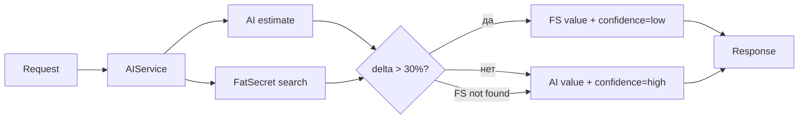

# HLD — Тикет 4.1 + 5.3: USDA/AI точность калорий

**Версия:** 1.0 | **Дата:** 2026-05-03 | **Приоритет:** P0 (4.1) + P1 (5.3, закрывается здесь же)

---

## Выбор тикета

4.1 выбран следующим после 8.1. 5.3 (prompt-тюнинг) — подмножество 4.1: оба затрагивают `_RECOGNIZE_PROMPTS` в `ai_service_v2.py`. Разделять нецелесообразно — двойное касание одного файла. Cross-check AI vs FatSecret верифицируется детерминированно по delta > threshold, не требует A/B или накопленного лога. Ошибки калорий разрушают доверие пользователя сильнее задержки — пользователь перестаёт логировать питание.

---

## Проблема

AI-режим (`ai_only` / `auto`) генерирует свободные оценки порций без привязки к реальным весам. FatSecret содержит откалиброванные значения, но используется только как fallback при недоступности AI. Результат: ±50–80% ошибка на распространённых продуктах (яблоко → 200 ккал вместо 70-80 ккал).

Дополнительно (5.3): prompt не требует визуального масштаба и не ограничивает верхнюю границу калорий — AI может вернуть 1500 ккал для стандартного обеда.

---

## Решение — три слоя без миграций

### Слой 1 — Prompt hardening (решает 5.3)

В `_RECOGNIZE_PROMPTS` добавить три жёстких инструкции:
- Требовать visual reference scale при оценке веса (рука, тарелка 26 см, стандартный стакан 250 мл)
- Если scale не виден — использовать conservative estimate (нижняя граница reasonable range для данного продукта)
- `total_calories` для одного блюда в одном запросе не превышает 1200 ккал без явного контекста ("праздничный торт", "семейная пицца")

### Слой 2 — Portion normalization

Если FatSecret вернул `serving_size_g` для найденного продукта — использовать его как anchor:

```
normalize_to_fatsecret_serving(ai_weight_g, fs_serving_g, fs_kcal_per_serving)
  → kcal = (ai_weight_g / fs_serving_g) * fs_kcal_per_serving
```

Это заменяет AI-guess на математически корректный пересчёт по реальным данным.

### Слой 3 — Cross-check delta

После получения AI-результата и FatSecret-результата (параллельно в `auto`-режиме):
- Если `|ai_kcal - fs_kcal| / fs_kcal > 0.30` → использовать FatSecret как основное значение
- Добавить поле `confidence: "low"` в ответ API
- Логировать оба значения через `logger.warning` (для будущего анализа без изменений схемы БД)

Если FatSecret не нашёл продукт — AI-значение проходит без изменений, cross-check не срабатывает.

---

## Диаграмма



---

## Файлы

| Файл | Изменение |
|------|-----------|
| `app/services/ai_service_v2.py` | prompt hardening + `normalize_to_fatsecret_serving()` + cross-check delta logic |
| `app/services/fatsecret_service.py` | добавить `search_best_match(name) -> dict | None` если метода нет |

Мигрировать БД не нужно. Если `meals.meta` jsonb существует — можно писать туда; если нет — только `logger.warning`.

---

## Риски и ограничения

- FatSecret может не найти продукт по AI-названию (разный язык, транслитерация) → cross-check срабатывает только при совпадении, иначе AI-значение проходит как есть. Это не регрессия, а сохранение текущего поведения.
- Порог 30% — эмпирический. QA верифицирует на 5 тест-кейсах; backend-dev оставляет как named constant `CALORIES_CROSS_CHECK_THRESHOLD = 0.30` для будущей настройки.
- Prompt cap 1200 ккал может срезать легитимные случаи (большой бургер ~900 ккал + картошка). Формулировка в prompt должна допускать override через контекст запроса, не быть жёстким числовым фильтром в коде.
- Если `fatsecret_service.py` уже имеет search — переиспользовать, не дублировать.

---

## Декомпозиция для backend-dev

| # | Задача | Файл | Оценка |
|---|--------|------|--------|
| 4.1-A | Prompt hardening: добавить scale reference + conservative estimate + 1200 ккал soft cap в `_RECOGNIZE_PROMPTS` | `ai_service_v2.py` | 0.5 ч |
| 4.1-B | Реализовать `normalize_to_fatsecret_serving(ai_weight_g, fs_serving_g, fs_kcal_per_serving) -> float` как pure function | `ai_service_v2.py` | 0.5 ч |
| 4.1-C | Реализовать cross-check: получить FS-результат параллельно с AI, сравнить delta, выбрать победителя, выставить `confidence` | `ai_service_v2.py` | 1 ч |
| 4.1-D | Проверить `fatsecret_service.py`: есть ли `search_best_match`; добавить если нет; убедиться что возвращает `serving_size_g` и `calories_per_serving` | `fatsecret_service.py` | 0.5 ч |
| 4.1-E | Smoke-тест: яблоко / куриная грудь / борщ в режиме `auto` — cross-check логируется, значения в разумных диапазонах | — | 0.5 ч |

**Итого: ~3 ч**

---

## Декомпозиция для qa-engineer

| # | Проверка |
|---|----------|
| QA-4.1-1 | AI-режим: яблоко 150 г → ≤80 ккал (до fix мог давать 200+) |
| QA-4.1-2 | Cross-check активен: продукт где AI даёт >30% vs FatSecret → в ответе используется FS-значение, `confidence=low` |
| QA-4.1-3 | FatSecret не нашёл продукт → AI-значение проходит без изменений, нет 500-ошибки |
| QA-4.1-4 | Prompt cap: запрос без scale reference → `total_calories` ≤ 1200 для стандартного одного блюда |
| QA-4.1-5 | Регрессия: `fatsecret_only`-режим не изменил поведения |
