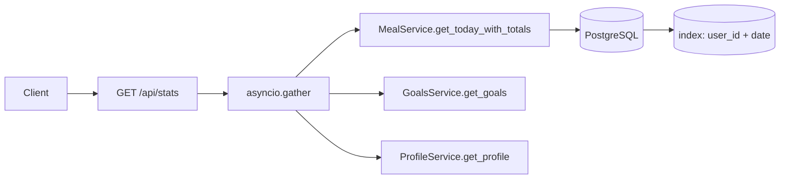

# HLD — Тикет 8.1: Dashboard loading speed

**Версия:** 1.0 | **Дата:** 2026-05-03 | **Приоритет:** P0

---

## Выбор тикета

**8.1 Dashboard loading speed** выбран следующим после 3.7.

Обоснование: пользователь видит "зависание" стартового экрана — это прямой удар по retention, воспроизводится у каждого при каждом открытии приложения. Решение локализовано в 2-3 файлах сервисного слоя + одна миграция без downtime. 4.1 (USDA точность) затрагивает ai_service_v2.py + FatSecret pipeline и требует верификации улучшения через логирование — нельзя подтвердить fix за один dispatch.

---

## Проблема

При открытии Dashboard Flutter-клиент делает 4 последовательных или параллельных запроса:
- `GET /api/stats`
- `GET /api/goals`
- `GET /api/profile`
- `GET /api/meals` (с date filter после 3.7)

Каждый из них на стороне backend потенциально выполняет несколько SQL-запросов. Подозреваемые узкие места:

1. **`get_today_totals` в `meal_service.py`** — судя по коду, это отдельный `SUM` запрос к таблице `meals`. Если вызывается из `stats`-роутера вместе с `get_today` (полный SELECT всех строк), то одни и те же строки читаются дважды: N+1 паттерн на уровне сервисов.

2. **Отсутствие индекса `meals(user_id, created_at)`** — таблица `meals` фильтруется по `user_id AND created_at::date = ...` в трёх местах (`get_today`, `get_today_totals`, `get_compulsive_count`). Без составного индекса — seq scan по всем записям пользователя при каждом запросе.

3. **`goals_service` и `calculation_service`** — вероятно, читают `users` + `goals` отдельными запросами там, где можно JOIN.

4. **Нет кэширования** суточных агрегатов: каждый refresh Dashboard пересчитывает SUM с нуля.

---

## Решение

### Шаг 1 — Индекс на `meals` (миграция)

```sql
CREATE INDEX CONCURRENTLY IF NOT EXISTS idx_meals_user_date
ON meals (user_id, (created_at::date));
```

`CONCURRENTLY` — нет блокировки таблицы. Покрывает все три метода MealService.

Файл миграции: `backend/migrations/YYYYMMDD_add_meals_user_date_index.sql`

### Шаг 2 — Слияние двойного чтения в MealService

Текущая ситуация: роутер stats предположительно вызывает `get_today()` (полный SELECT) и `get_today_totals()` (агрегирующий SELECT) — две поездки в БД для одних данных.

Решение: добавить метод `get_today_with_totals()` в `MealService`, который возвращает `(list[Record], dict)` за один SQL с `SUM(...) OVER ()` или двумя CTE в одном запросе. Роутер stats вызывает только его.

Файл: `app/services/meal_service.py`

### Шаг 3 — Параллельные запросы в stats-роутере

Если `goals` и `profile` запрашиваются последовательно — заменить на `asyncio.gather()`. Это бесплатно снижает суммарное время ответа с `T1+T2+T3` до `max(T1,T2,T3)`.

Файл: роутер, который отвечает за `/api/stats` (предположительно `app/routers/stats.py` или `meals.py`)

### Шаг 4 — Короткоживущий кэш суточных тоталов (опционально, если 1-3 недостаточно)

Если после шагов 1-3 latency всё ещё >500ms: добавить in-memory кэш (простой `dict` с TTL 30s) для `get_today_totals` по ключу `(user_id, date)`. Invalidate при `add/update/delete` meal.

Файл: `app/services/meal_service.py` или отдельный `app/services/stats_cache.py`

---

## Диаграмма



---

## Файлы

| Файл | Изменение |
|------|-----------|
| `backend/migrations/YYYYMMDD_add_meals_user_date_index.sql` | новый — индекс CONCURRENTLY |
| `app/services/meal_service.py` | новый метод `get_today_with_totals` |
| `app/routers/stats.py` (или аналог) | `asyncio.gather` + вызов нового метода |

---

## Риски и ограничения

- `CREATE INDEX CONCURRENTLY` требует отдельной транзакции — нельзя запускать внутри `BEGIN`. Выполняется напрямую через psql или миграционный скрипт без обёртки в транзакцию.
- Если stats-роутер не существует отдельно, а вшит в другой файл — backend-dev уточняет перед реализацией.
- Шаг 4 (in-memory кэш) пропустить если шаги 1-3 дают <300ms — усложнение без необходимости (YAGNI).

---

## Декомпозиция для backend-dev

| # | Задача | Файл | Оценка |
|---|--------|------|--------|
| 8.1-A | Написать и применить миграцию `idx_meals_user_date` | `migrations/` | 0.5 ч |
| 8.1-B | Добавить `get_today_with_totals` в MealService (один SQL, CTE или `SUM OVER`) | `meal_service.py` | 1 ч |
| 8.1-C | Найти stats-роутер, заменить последовательные вызовы на `asyncio.gather`, подключить новый метод | `routers/stats.py` | 1 ч |
| 8.1-D | Smoke-тест: замерить время ответа `/api/stats` до и после через `time curl` или `httpx` | — | 0.5 ч |

**Итого: ~3 ч**

---

## Декомпозиция для qa-engineer

| # | Проверка |
|---|----------|
| QA-8.1-1 | `GET /api/stats` возвращает те же данные что и до изменений (регрессия на содержимое) |
| QA-8.1-2 | Время ответа `/api/stats` при наличии 50+ meals у пользователя — до и после (ожидаем >2x улучшение) |
| QA-8.1-3 | `asyncio.gather` не ломает ответ при пустом дне (0 meals, нет goals) |
| QA-8.1-4 | Добавление/удаление meal в тот же день → следующий вызов `/api/stats` отражает актуальные тоталы (no stale cache) |
| QA-8.1-5 | Индекс виден в `\d+ meals` или через `pg_indexes` |
