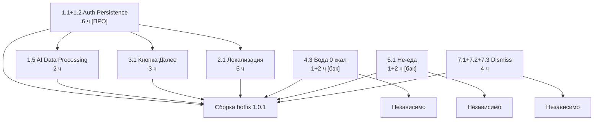

# HLD — Hotfix P0 · Kayfit Flutter · 2026-05-02

> Версия: 1.0.1-hotfix  
> Дата: 2026-05-02  
> Автор: architect agent  
> Основание: ТЗ_исправления_первый_запуск.md §1.1–7.3, раздел 11 «Hotfix»

---

## 1. Executive Summary

Hotfix закрывает 10 P0-багов, которые разрушают первый пользовательский опыт: пользователи разлогиниваются, теряют данные онбординга, видят смешанный русско-английский интерфейс, не могут закрыть шторки и выйти из чата, а вода считается калорийной. Ни один из этих багов не требует новой бизнес-логики — все они представляют собой инфраструктурные недочёты первой версии.

Общая оценка: **фронт ~27 ч**, **бэк ~4 ч**. Бэкенд задействован только в двух тикетах: 4.3 (водный whitelist) и 5.1 (классификатор is_food). Остальные восемь тикетов — чисто Flutter. Критический блокер всего остального — тикет 1.2/1.1 (auth persistence), без которого любой другой фикс бесполезен: пользователь всё равно разлогинится.

Ключевое архитектурное открытие: реальный бэкенд (openapi.json) использует JWT Bearer + refresh token (`POST /api/v1/auth/refresh`), а не session cookie. Предыдущая архитектурная документация описывала `PersistCookieJar` — это расхождение и есть корневая причина тикетов 1.1 и 1.2. Hotfix устраняет это расхождение, переводя хранение токенов на `flutter_secure_storage` (Keychain на iOS, EncryptedSharedPreferences на Android).

---

## 2. Технические оси проблемы (корневые причины)

Группировка 10 тикетов по корням позволяет избежать 10 независимых патчей и сфокусироваться на 5 осях:

### Ось A — Auth persistence (1.1 + 1.2)
**Единая проблема**: токены хранятся небезопасно или в памяти, не переживают kill/background. Решение — один `SecureTokenStorage` сервис + `AuthInterceptor` с silent refresh. Фикс обоих тикетов одним PR.

### Ось B — Локализация (2.1)
**Единая проблема**: нет единого источника правды для выбранного языка. Часть строк захардкожена, часть экранов читает `Locale` из системы, не из приложения. Решение — `LocaleNotifier` (Riverpod) + `SharedPreferences` + пересмотр `MaterialApp.locale`. Один рефакторинг закрывает все подтикеты 2.1.

### Ось C — UX dismiss-поведения (7.1 + 7.2 + 7.3)
**Единая проблема**: отсутствует единый паттерн закрытия. Клавиатура не скрывается по тапу вне поля, шторки не реагируют на drag/tap-outside, чат-экран не имеет back-навигации. Решение — общий `DismissibleSheetWrapper` виджет + `GestureDetector` паттерн для клавиатуры. Один рефакторинг на все три тикета.

### Ось D — Онбординг state (3.1)
**Отдельная проблема**: кнопка «Далее» перекрывается клавиатурой или теряется при ребилде. Требует аудита всех шести экранов онбординга + `resizeToAvoidBottomInset` / `SingleChildScrollView` паттерна.

### Ось E — AI/бэк логика (4.3 + 5.1)
**Две разные бэк-проблемы**, объединены по типу исполнителя (бэкенд-разработчик):
- 4.3: вода получает ненулевые калории → whitelist нулевых продуктов на бэке
- 5.1: не-еда распознаётся как еда → добавить `is_food` классификатор в промпт/пост-обработку

---

## 3. Per-ticket план

---

### Тикет 1.1 + 1.2 — Auth Persistence (объединены)

**Корневая причина**  
Бэкенд возвращает `TokenResponse { access_token, refresh_token, expires_in }` (JWT Bearer, эндпоинт `/api/v1/auth/refresh`). Текущая реализация либо хранит токены только в памяти провайдера, либо в незашифрованном `SharedPreferences`, что не переживает kill процесса или iOS jetsam. При каждом холодном старте токен недоступен → 401 → redirect на онбординг.

**Solution**  
1. Добавить `flutter_secure_storage: ^9.0.0` в `pubspec.yaml` (Keychain iOS / EncryptedSharedPreferences Android).  
2. Создать `lib/core/auth/secure_token_storage.dart` — сервис с методами `saveTokens`, `loadTokens`, `clearTokens`.  
3. В `lib/core/api/auth_interceptor.dart` реализовать silent refresh: при 401 вызвать `POST /api/v1/auth/refresh { refresh_token }`, сохранить новые токены, повторить оригинальный запрос. При ошибке refresh → `clearTokens` + `ref.invalidate(currentUserProvider)`.  
4. `lib/core/auth/auth_provider.dart` — при старте приложения читать токены из `SecureTokenStorage`, инициализировать `currentUserProvider`.  
5. Прогресс онбординга сохранять в `SharedPreferences` после каждого шага (ключ `onboarding_step_N`). При возврате в приложение восстанавливать с последнего шага через `onboardingProgressProvider`.

**Файлы для правки**  
- `pubspec.yaml` — добавить `flutter_secure_storage: ^9.0.0`  
- `lib/core/auth/secure_token_storage.dart` — **новый файл**  
- `lib/core/auth/auth_interceptor.dart` — добавить silent refresh логику  
- `lib/core/auth/auth_provider.dart` — инициализация из SecureStorage  
- `lib/core/api/api_client.dart` — убрать `PersistCookieJar`, добавить `Bearer` header  
- `lib/features/onboarding/providers/onboarding_provider.dart` — сохранение шагов в SharedPrefs

**Бэкенд-зависимость**: нет. Эндпоинт `POST /api/v1/auth/refresh` уже есть в openapi.json.

**Acceptance**  
- [ ] После закрытия приложения на 24 ч — пользователь остаётся залогинен.  
- [ ] Silent refresh без перехода на логин.  
- [ ] Прогресс онбординга восстанавливается после kill.  
- [ ] Авторизованный пользователь после kill → сразу главный экран.

**Сложность**: ПРО-РАЗРАБОТЧИК. Смена схемы auth (cookie → Bearer + SecureStorage) — критическая смена инфраструктуры, требует ручной отладки Keychain entitlements на iOS и проверки миграции существующих сессий.

**Оценка**: фронт 6 ч, бэк 0 ч.

---

### Тикет 1.5 — Зависание AI Data Processing

**Корневая причина**  
После нажатия «Accept & Continue» нет немедленной визуальной реакции. Запрос к бэку блокирует UI без индикатора прогресса. Нет таймаута на Dio-запрос для этого экрана.

**Solution**  
1. В `lib/features/ai_consent/screens/ai_consent_screen.dart` — при тапе немедленно переводить кнопку в `loading` состояние (`isLoading = true` в локальном state/notifier).  
2. Показывать `CircularProgressIndicator` внутри кнопки пока идёт запрос.  
3. Если переход занимает > 300 мс — `LinearProgressIndicator` вверху экрана.  
4. Таймаут Dio для этого запроса: 5 с (`receiveTimeout`). При истечении — `SnackBar` «Не удалось подключиться. Повторите попытку» + кнопка «Повторить».  
5. Использовать `ref.read(aiConsentNotifierProvider.notifier).accept()` с `AsyncValue` — `loading/data/error` состояния уже покрывают весь UX.

**Файлы для правки**  
- `lib/features/ai_consent/screens/ai_consent_screen.dart`  
- `lib/features/ai_consent/providers/ai_consent_provider.dart` — добавить `AsyncNotifier` с таймаутом  
- `lib/core/api/api_client.dart` — убедиться что `receiveTimeout` задан глобально (5–10 с)

**Бэкенд-зависимость**: нет.

**Acceptance**  
- [ ] Реакция на тап ≤ 100 мс.  
- [ ] Лоадер появляется если переход > 300 мс.  
- [ ] При таймауте 5 с — сообщение + кнопка «Повторить».

**Сложность**: вайбкодинг. Стандартный `AsyncNotifier` паттерн Riverpod.

**Оценка**: фронт 2 ч, бэк 0 ч.

---

### Тикет 2.1 — Слетающий язык RU↔EN

**Корневая причина**  
Нет единого источника правды для выбранного языка. Часть виджетов берёт локаль из `Localizations.localeOf(context)` (системная), другие используют хардкод-строки на EN, третьи читают `language` из `UserProfileResponse` (который приходит с бэка асинхронно, поэтому до загрузки профиля → fallback на EN). При навигации `Locale` сбрасывается.

**Solution**  
1. Создать `lib/core/locale/locale_notifier.dart` — `Notifier<Locale>` (Riverpod). При старте читает из `SharedPreferences` ключ `app_locale`. Default: `Locale('ru')`.  
2. В `app.dart` (`MaterialApp.router`) задать `locale: ref.watch(localeNotifierProvider)`. Это единственная точка установки локали.  
3. Аудит `.arb` файлов в `assets/l10n/`: все строки онбординга, чата, AI-consent, настроек должны быть в `app_ru.arb` и `app_en.arb`. Хардкод-строки заменить на `AppLocalizations.of(context)!.keyName`.  
4. При смене языка в Settings: `ref.read(localeNotifierProvider.notifier).setLocale(newLocale)` + `SharedPreferences.setString('app_locale', langCode)` + `POST /api/profile { language: langCode }`.  
5. Язык из `UserProfileResponse.language` используется только при первом входе (если нет локального значения в SharedPrefs).

**Файлы для правки**  
- `lib/core/locale/locale_notifier.dart` — **новый файл**  
- `lib/app.dart` — подключить `localeNotifierProvider`  
- `assets/l10n/app_ru.arb` — проверить полноту строк  
- `assets/l10n/app_en.arb` — проверить полноту строк  
- Все экраны онбординга (`lib/features/onboarding/screens/*.dart`) — заменить хардкод  
- `lib/features/settings/screens/settings_screen.dart` — добавить переключатель языка  
- `lib/features/ai_consent/screens/ai_consent_screen.dart` — перевести все строки

**Бэкенд-зависимость**: нет (сохранение языка в профиль через уже существующий `POST /api/profile` с полем `language` в `UserProfileRequest`).

**Acceptance**  
- [ ] При RU — все экраны онбординга на RU без исключений.  
- [ ] Возврат назад не меняет язык.  
- [ ] После онбординга сохраняется выбранный язык.  
- [ ] В Settings есть переключатель RU/EN.  
- [ ] Нет ни одного экрана со смешанной локализацией.

**Сложность**: вайбкодинг для рутинной замены хардкода + ПРО-РАЗРАБОТЧИК для аудита всех строк и архитектуры `LocaleNotifier`. Разделить: про-разработчик создаёт `LocaleNotifier` и подключает в `app.dart`, вайбкодер делает аудит и замену хардкода по шаблону.

**Оценка**: фронт 5 ч (2 ч архитектура + 3 ч аудит), бэк 0 ч.

---

### Тикет 3.1 — Пропадает кнопка «Далее»

**Корневая причина**  
При открытии клавиатуры на экранах с текстовым вводом кнопка «Далее» оказывается за пределами экрана. `Scaffold` не использует `resizeToAvoidBottomInset` правильно, либо кнопка расположена в `Column` без прокрутки и перекрывается `MediaQuery.viewInsets.bottom`.

**Solution**  
1. Аудит всех шести экранов онбординга (файлы `lib/features/onboarding/screens/*.dart`): на каждом должна быть кнопка «Далее» / «Пропустить».  
2. Паттерн для экранов с TextField:
   ```
   Scaffold(
     resizeToAvoidBottomInset: true,
     body: SingleChildScrollView(
       reverse: true, // прокручивает к полю ввода
       child: Column(
         children: [
           ...content,
           SizedBox(height: MediaQuery.viewInsetsOf(context).bottom + 80),
         ],
       ),
     ),
     bottomNavigationBar: SafeArea(child: NextButton(...)),
   )
   ```
3. Кнопка «Далее» — всегда в `bottomNavigationBar` или `Positioned` над клавиатурой, не внутри скроллируемой области.  
4. Disabled-состояние (серая кнопка) если обязательное поле пустое — кнопка всегда видна.

**Файлы для правки**  
- `lib/features/onboarding/screens/` — все экраны (примерно 6–8 файлов)  
- `lib/shared/widgets/` — возможно создать `next_button.dart` как общий виджет

**Бэкенд-зависимость**: нет.

**Acceptance**  
- [ ] На каждом экране онбординга есть видимая кнопка перехода вперёд.  
- [ ] Кнопка не уезжает за экран при клавиатуре.  
- [ ] Опциональные поля имеют «Пропустить».

**Сложность**: вайбкодинг. Стандартный Flutter-паттерн с `bottomNavigationBar`.

**Оценка**: фронт 3 ч, бэк 0 ч.

---

### Тикет 4.3 — Вода 0 ккал

**Корневая причина**  
AI-модель на бэке не имеет хардкод-обработки нулевых продуктов. При распознавании «вода в стакане» модель возвращает ненулевые калории из USDA (вода действительно имеет запись с 0 ккал, но AI может выбрать не ту строку).

**Solution**  
На бэкенде: добавить post-processing whitelist в обработчик `/api/recognize_photo` и `/api/parse_meal`:
```python
ZERO_CALORIE_KEYWORDS = [
  'water', 'вода', 'sparkling water', 'газированная вода',
  'tea', 'чай', 'coffee black', 'кофе черный', 'black coffee'
]
# После получения ответа от AI — если name.lower() совпадает с whitelist → calories=0
```
На фронтенде: дополнительная локальная проверка в `lib/features/add_meal/providers/add_meal_provider.dart` — если `name` содержит ключевые слова воды → `calories = 0` до отправки на бэк.

**Файлы для правки**  
- Бэк: обработчик `recognize_photo` и `parse_meal` (точные пути — вопрос к разработчику, см. раздел 7)  
- `lib/features/add_meal/providers/add_meal_provider.dart` — локальная проверка

**Бэкенд-зависимость**: да. Требуется изменение бэкенда для надёжного решения.

**Acceptance**  
- [ ] Вода в любом виде → 0 ккал.  
- [ ] Тест-кейс: «вода в стакане 250 мл» → 0 ккал.

**Сложность**: вайбкодинг (фронт-часть), ПРО-РАЗРАБОТЧИК (бэк-whitelist + тесты).

**Оценка**: фронт 1 ч, бэк 2 ч.

---

### Тикет 5.1 — Распознавание не-еды как еды

**Корневая причина**  
Бэкенд не имеет классификатора «is food / not food» перед расчётом калорий. При любом фото модель пытается найти еду и возвращает случайные значения.

**Solution**  
На бэкенде: в промпт к AI добавить первичный шаг:
```
Step 1: Is there food in this image? Answer YES or NO with confidence 0–100.
If NO or confidence < 60: return { "is_food": false, "items": [], "error": "no_food_detected" }
Step 2 (only if is_food=true): identify food items and calculate calories.
```
На фронтенде: обработать `RecognizePhotoResponse.error == "no_food_detected"`:
- Показать диалог: «Не удалось распознать еду на фото. Поднесите камеру ближе к блюду.»
- Кнопка «Попробовать ещё раз» + кнопка «Ввести вручную».

Изменение контракта `RecognizePhotoResponse`: добавить поле `is_food: bool` (необязательное, бэк уже возвращает `error: string | null`). Для фронта достаточно проверять `items.isEmpty && error != null`.

**Файлы для правки**  
- Бэк: обработчик `recognize_photo` — промпт-инжиниринг  
- `lib/features/add_meal/screens/photo_input_screen.dart` — обработка `error` состояния  
- `lib/features/add_meal/providers/add_meal_provider.dart` — состояние `noFoodDetected`

**Бэкенд-зависимость**: да. Изменение промпта на бэке (не меняет OpenAPI контракт — `error` поле уже есть).

**Acceptance**  
- [ ] Фото без еды → понятное сообщение, не падение.  
- [ ] Тест-кейс: собака, пейзаж, текст → «не еда».

**Сложность**: вайбкодинг (фронт), ПРО-РАЗРАБОТЧИК (промпт-инжиниринг на бэке + тестирование).

**Оценка**: фронт 1 ч, бэк 2 ч.

---

### Тикеты 7.1 + 7.2 + 7.3 — Клавиатура, шторки, выход из чата (объединены)

**Корневая причина**  
Отсутствует единый паттерн dismiss-поведений. Flutter по умолчанию не скрывает клавиатуру по тапу вне `TextField`. `showModalBottomSheet` / `DraggableScrollableSheet` не настроены на `isDismissible: true` / `enableDrag: true`. Экран AI-чата открыт через `push` без `AppBar` с back-кнопкой.

**Solution**

**7.1 — Клавиатура:**  
В `lib/app.dart` добавить глобальный `GestureDetector` враппер (или `TapRegion`) с `onTap: () => FocusScope.of(context).unfocus()`. Это один раз закрывает клавиатуру для всего приложения.  
Для чата дополнительно: `ListView` → `keyboardDismissBehavior: ScrollViewKeyboardDismissBehavior.onDrag`.  
`InputAccessoryView` с кнопкой «Готово» — через `Padding` виджет над клавиатурой или `CupertinoTextField.suffix`.

**7.2 — Bottom sheets:**  
Создать `lib/shared/widgets/dismissible_bottom_sheet.dart` — обёртка с параметрами:
```dart
showModalBottomSheet(
  isDismissible: true,        // тап на затемнение
  enableDrag: true,           // свайп вниз
  showDragHandle: true,       // drag handle видна
  builder: ...
)
```
Во всех местах вызова `showModalBottomSheet` заменить на этот wrapper. Добавить кнопку `X` в правый верхний угол каждого sheet-контента.

**7.3 — Выход из AI-чата:**  
В `lib/features/chat/screens/` добавить `AppBar` со стрелкой назад (`automaticallyImplyLeading: true`).  
Если чат открывается через `context.push('/chat')` — go_router обеспечивает back через `context.pop()`.  
Если чат — модальный bottom sheet: `DraggableScrollableSheet` + drag-down закрывает.

**Файлы для правки**  
- `lib/app.dart` — глобальный GestureDetector для unfocus  
- `lib/shared/widgets/dismissible_bottom_sheet.dart` — **новый файл**  
- `lib/features/chat/screens/chat_screen.dart` — добавить AppBar + back  
- `lib/features/add_meal/screens/` — заменить bottomSheet вызовы на wrapper  
- Все места `showModalBottomSheet` в `lib/` — использовать новый wrapper

**Бэкенд-зависимость**: нет.

**Acceptance**  
- [ ] Тап вне поля → клавиатура исчезает (7.1).  
- [ ] Свайп по сообщениям → клавиатура убирается интерактивно (7.1).  
- [ ] Все три способа закрытия шторки (тап вне, свайп вниз, кнопка X) (7.2).  
- [ ] Из чата можно выйти минимум двумя способами (7.3).

**Сложность**: вайбкодинг. Стандартные Flutter/go_router паттерны.

**Оценка**: фронт 4 ч (1.5 ч клавиатура + 1.5 ч шторки + 1 ч чат), бэк 0 ч.

---

## 4. Зависимости и порядок



**Порядок выполнения:**

| Фаза | Задачи | Параллелизм | Фундамент |
|------|--------|-------------|-----------|
| 1 (день 1) | **1.1+1.2** Auth | — | Блокирует тестирование всего остального |
| 2 (день 1–2) | **2.1** Локализация, **3.1** Кнопка, **7.x** Dismiss | Все три параллельно | После Auth |
| 3 (день 2) | **1.5** AI Processing, **4.3** Вода, **5.1** Не-еда | Фронт-части параллельно | Бэк-части от бэкенд-разработчика |
| 4 (день 3) | QA + регресс + сборка | — | |

**Критический путь**: 1.1/1.2 → всё остальное. Без рабочего auth нельзя тестировать ни один другой тикет.

**Бэкенд-параллельный трек**: тикеты 4.3 и 5.1 (бэк-части) можно и нужно отдать бэкенд-разработчику одновременно с фронт-работами дня 1.

---

## 5. Риски и mitigations

### Риск 1: Миграция существующих сессий (КРИТИЧЕСКИЙ)
Если пользователи уже залогинены через cookie (старая схема), после выкатки hotfix с Bearer-схемой они получат 401 и принудительный разлогин. **Mitigation**: проверить реальную схему auth в production (см. вопрос 1 в разделе 7). Если production уже использует Bearer — проблемы нет. Если была cookie — нужна миграция или принятое решение о «разовом разлогине всех».

### Риск 2: iOS Keychain Entitlements (ВЫСОКИЙ)
`flutter_secure_storage` требует Keychain Sharing entitlement в `ios/Runner/Runner.entitlements`. Без этого файл приложение упадёт на iOS в release-сборке. **Mitigation**: добавить entitlement при имплементации. Тест строго на реальном устройстве (не симулятор).

### Риск 3: Регресс локализации (ВЫСОКИЙ)
Аудит `.arb` файлов может вскрыть отсутствующие ключи, что сломает `AppLocalizations.of(context)!.key` (null-assert падение). **Mitigation**: использовать `AppLocalizations.of(context)?.key ?? 'fallback'` везде до полного аудита. Запустить `flutter gen-l10n` и проверить, что все ключи присутствуют в обоих `.arb` файлах перед PR.

### Риск 4: is_food контракт (СРЕДНИЙ)
Если бэкенд-разработчик добавит `is_food` как новое поле в `RecognizePhotoResponse` — фронт должен быть совместим со старыми ответами без этого поля. **Mitigation**: фронт использует `response.error != null && response.items.isEmpty` как признак «не еда» — этого достаточно без изменения контракта.

### Риск 5: Android EncryptedSharedPreferences (НИЗКИЙ)
На Android API < 23 `flutter_secure_storage` не поддерживает шифрование. **Mitigation**: минимальный SDK в `pubspec.yaml` / `AndroidManifest` — проверить, что `minSdkVersion >= 23`. Kayfit скорее всего уже таргетирует 23+.

---

## 6. Чек-лист к релизу

### Тесты

| Тип | Что покрываем |
|-----|---------------|
| Unit | `SecureTokenStorage`: saveTokens, loadTokens, clearTokens |
| Unit | `AuthInterceptor`: 401 → refresh → retry; 401 + refresh fail → clear + redirect |
| Unit | `LocaleNotifier`: init из SharedPrefs, setLocale, persist |
| Widget | `AiConsentScreen`: кнопка loading при тапе, таймаут-сообщение |
| Widget | `OnboardingScreen` N: кнопка «Далее» видна при открытой клавиатуре |
| Widget | `DismissibleBottomSheet`: закрытие по тапу вне, свайп вниз |
| Integration | Полный onboarding flow → auth → главный экран → kill → restart → главный экран |

### Регресс-тест вручную (12 фидбеков из ТЗ)

- [ ] Пройти онбординг → авторизоваться → свернуть → вернуться → данные сохранены (1.1)
- [ ] Закрыть приложение → открыть через 1 ч → остаться залогиненным (1.2)
- [ ] AI Data Processing Accept → отклик ≤ 100 мс (1.5)
- [ ] Пройти весь онбординг — язык RU на всех экранах (2.1)
- [ ] Вернуться назад в онбординге — язык не меняется (2.1)
- [ ] На каждом экране онбординга нажать на поле → кнопка «Далее» видна (3.1)
- [ ] Добавить воду → 0 ккал (4.3)
- [ ] Сфотографировать не-еду → понятное сообщение (5.1)
- [ ] Открыть AI-чат → напечатать → тап вне поля → клавиатура убирается (7.1)
- [ ] Открыть любую шторку → свайп вниз → закрылась (7.2)
- [ ] Открыть шторку → тап на затемнение → закрылась (7.2)
- [ ] Войти в AI-чат → нажать «Назад» → вернуться на предыдущий экран (7.3)

### Сборка

- iOS приоритет (все фидбеки с iOS устройств). Android сборка опциональна для hotfix, но желательна.
- Проверить Keychain entitlements в `ios/Runner/Runner.entitlements` перед архивированием.
- `flutter build ipa --release` — убедиться в отсутствии critical warnings.

### Версионирование

- `pubspec.yaml`: `version: 1.0.1+11` (bugfix patch + build number increment)
- Git tag: `v1.0.1-hotfix`
- Changelog: перечислить все 10 P0-тикетов

---

## 7. Вопросы к продукту/разработчику

1. **Какая auth-схема в production прямо сейчас?** Cookie или Bearer JWT? От ответа зависит стратегия миграции тикетов 1.1/1.2. Если уже Bearer и токены хранились в памяти — разлогин при смене на SecureStorage будет разовым. Если cookie — нужно решение.

2. **Где код бэкенда для recognize_photo / parse_meal?** Нужен доступ для тикетов 4.3 и 5.1. Конкретно: файл с обработчиком и промптом к AI-модели.

3. **Какая AI-модель используется для распознавания еды?** (GPT-4o Vision, Claude Vision, собственная модель?) От ответа зависит подход к 5.1: prompt engineering vs. отдельный классификатор vs. пороговые значения confidence.

4. **Сколько экранов в онбординге в текущей production сборке?** В ТЗ и memory — 6 шагов. В фидбеках упоминается «вторая страница опросника» с пропавшей кнопкой — нужен точный список экранов для аудита 3.1.

5. **Есть ли Firebase Remote Config / feature flags?** Если да — hotfix можно катить поэтапно (процент аудитории), что снижает риск миграции auth.
