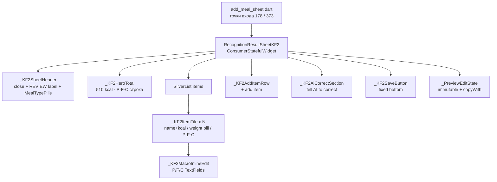

# KF2-PREVIEW-EDIT — HLD

> Экран предпросмотра и редактирования распознанной еды в стиле Kayfit 2.0.
> Заменяет `recognition_result_sheet_v2.dart` после прохождения ручного QA.
> Версия: draft 2026-05-03

---

## 1. Scope

**Входит:**
- Новый bottom sheet `RecognitionResultSheetKF2` — KF2-дизайн, JetBrains Mono hero, монохром
- Inline edit макронутриентов по ✏ с пересчётом kcal по 4/9/4
- Pill-инпут веса с live recalc через `IngredientV2.withWeight()`
- × удаление элемента
- "tell AI to correct" CTA → textarea → POST `/api/v2/correct_recognition`
- + add item → существующий `_V2IngredientSearchSheet` (повторное использование)
- MealType picker (завтрак/обед/ужин/перекус) — pill-tabs вместо dropdown
- Save через существующий `_save()` payload — тот же API `/api/meals/add_selected`

**НЕ входит:**
- USDA-badge (убирается полностью)
- Donut ring / fl_chart (убирается)
- Nutrient detail expansion (micronutrients, GI) — скрыть в этой версии, можно добавить в будущем
- Apple Activity rings (KayfitRings не нужен на этом экране — только в Journal)
- Полная миграция всех точек входа (только после QA)

---

## 2. Диаграмма компонентов



---

## 3. Файлы

### Новые файлы

| Путь | Ответственность |
|------|----------------|
| `lib/features/add_meal/screens/recognition_result_sheet_kf2.dart` | Главный виджет + state logic (~400 строк) |
| `lib/features/add_meal/widgets/kf2_item_tile.dart` | Tile ингредиента с weight pill и inline edit |
| `lib/features/add_meal/widgets/kf2_hero_total.dart` | Hero секция с JetBrains Mono 56px |
| `lib/features/add_meal/widgets/kf2_ai_correct_section.dart` | Dashed-border CTA + textarea |
| `lib/features/add_meal/widgets/kf2_meal_type_pills.dart` | Pill-tabs вместо dropdown |

### Изменяемые файлы (минимально)

| Файл | Изменение |
|------|-----------|
| `lib/features/add_meal/sheets/add_meal_sheet.dart` | Добавить флаг `useKF2 = true` (кег-флаг). При true открывать `RecognitionResultSheetKF2` рядом со старым. Старый остаётся до QA. |

### Удаляемые файлы (после QA)

- `lib/features/add_meal/screens/recognition_result_sheet_v2.dart` — удалить после прохождения ручного QA-чеклиста

---

## 4. Контракт поведения

### 4.1 State model

```dart
// Immutable, не freezed — простой copyWith достаточен
class _PreviewEditState {
  final List<IngredientV2> items;
  final String mealType;
  final bool saving;
  final bool correcting;        // секция AI раскрыта
  final bool correctionLoading;
  final String? correctionError;
  final int? activeInlineEditIndex; // какой tile в режиме macro-edit

  _PreviewEditState copyWith({...});
}
```

### 4.2 Weight pill

- `TextInputType.numberWithOptions(decimal: true)`, onChanged с debounce 300ms
- Валидация: `double.tryParse` → если null или <= 0 — не применять, подсветить pill красным border
- При применении: `item.withWeight(newWeight)` → пересчёт `nutrientsTotal` через существующий `_scaleNutrients`
- После onSubmitted — `FocusScope.unfocus()`

### 4.3 Inline macro edit (✏)

- Тап ✏ на tile → `activeInlineEditIndex = i`
- Показывает три `TextField` (P / F / C) в граммах
- `onChanged` любого поля: `calories = P*4 + F*9 + C*4` — обновить локально
- `nutrientsPer100g` пересчитывается обратно: `per100 = macro * 100 / weight`
- При потере фокуса всех трёх → `activeInlineEditIndex = null`
- Кнопка Done (✓) рядом с полями ускоряет выход из edit

### 4.4 AI correct

- Тап на dashed CTA → раскрыть textarea, автофокус
- POST `/api/v2/correct_recognition` — тот же payload что в V2 (`_applyCorrection`)
- Успех → replace `_state.items`, закрыть textarea, haptic
- Ошибка → показать inline error text под textarea (не SnackBar — SnackBar плохо виден за шторкой)

### 4.5 Удаление

- × тап → `HapticFeedback.lightImpact()` → `items.removeAt(i)`
- Если после удаления `items.isEmpty` → показать empty state в теле + disable Save

### 4.6 Save

- Тот же payload что в `_save()` V2 → `POST /api/meals/add_selected`
- `_totals` считается по тем же правилам из `_selected` (все items `selected=true` по умолчанию, checkbox убирается)
- После успеха: `ref.invalidate(todayStatsProvider)`, `ref.invalidate(todayMealsProvider)`, `Navigator.pop(true)`

### 4.7 Edge cases

| Случай | Поведение |
|--------|-----------|
| `items` пуст изначально | Empty state с иконкой + текст "Nothing recognized — add items manually", Save задизаблен |
| Все items удалены | То же |
| `weight` <= 0 | Pill подсвечивается `K2Colors.error` (красный #FF3B30), значение не применяется |
| Отрицательные макро в inline edit | Зажать минимум 0 |
| `calories` = 0 после пересчёта P+F+C | Разрешено (zero-calorie food) |
| Correction API 5xx | inline error без spinner, кнопка retry |
| Save API 5xx | SnackBar (контекст не под шторкой после pop) |
| Быстрый двойной тап Save | Guard `_saving` flag |

---

## 5. Дизайн-токены (KF2)

| Элемент | Значение |
|---------|---------|
| Background | `K2Colors.lightBg` = `#FAFAFA` |
| Surface (карточки items) | `K2Colors.lightCard` = `#FFFFFF` |
| Hero kcal | JetBrains Mono 56px, w500, ls -2.5, `K2Colors.lightFg` |
| P/F/C строка | JetBrains Mono 13px, `K2Colors.lightFgDim` |
| Item name | Geist 15px w500, `K2Colors.lightFg` |
| Item kcal | JetBrains Mono 15px w500, `K2Colors.lightFgDim` |
| Weight pill | border `K2Colors.lightBorder`, radius 20, padding 8×14 |
| Section label | Geist 10px uppercase ls 0.8, `K2Colors.lightFgMute` |
| × button | `K2Colors.error` = `Color(0xFFFF3B30)` |
| Save CTA | bg `K2Colors.lightFg`, text `K2Colors.lightBg`, radius 12 |
| AI dashed border | `K2Colors.lightBorderStrong` dashed |

---

## 6. Декомпозиция для frontend-dev

**Порядок реализации:**

1. `_PreviewEditState` — иммутабельный класс с `copyWith`, тесты на recalc
2. `kf2_hero_total.dart` — `_KF2HeroTotal` stateless, принимает `NutrientsV2 totals`
3. `kf2_item_tile.dart` — `_KF2ItemTile` с weight pill (без inline edit)
4. Собрать `RecognitionResultSheetKF2` с header + hero + list + save — проверить на девайсе
5. `kf2_meal_type_pills.dart` — горизонтальный Row pill-tabs
6. Добавить × delete + haptic в `_KF2ItemTile`
7. Добавить `_KF2MacroInlineEdit` — три TextField с 4/9/4 recalc
8. `kf2_ai_correct_section.dart` — dashed CTA + textarea + error state
9. Добавить + add item (передать существующий `_V2IngredientSearchSheet`)
10. Подключить `useKF2` флаг в `add_meal_sheet.dart`

Каждый шаг — отдельный коммит. Нет step-skip.

---

## 7. Test plan для QA

| # | Сценарий | Ожидаемый результат |
|---|----------|---------------------|
| T1 | Открыть шторку с 2 ингредиентами | Hero показывает сумму kcal; P/F/C строка корректна |
| T2 | Изменить вес ингредиента с 150г на 200г | Hero kcal пересчитывается live; нельзя ввести 0 или буквы |
| T3 | Тап ✏ → изменить Protein с 46г на 30г | kcal в tile = 30*4 + F*9 + C*4; Hero пересчитывается |
| T4 | Удалить один из двух ингредиентов | Hero обновляется; пустой список → Save задизаблен |
| T5 | "tell AI to correct": ввести "no rice, add quinoa" → отправить | Список items заменяется; textarea закрывается; Hero пересчитан |
| T6 | Тап Save → успех | Шторка закрывается; Journal обновляется (todayStats invalidate) |
| T7 | Тап Save с пустым списком | Кнопка задизаблена, нажать нельзя |

---

## 8. Риски

| Риск | Вес | Митигация |
|------|-----|-----------|
| `_V2IngredientSearchSheet` — приватный класс внутри V2 файла | Средний | Вынести в отдельный файл `ingredient_search_sheet.dart` на шаге 9 |
| `K2Colors` не имеет `error`-токена | Низкий | Добавить `static const error = Color(0xFFFF3B30)` в `kayfit2_theme.dart` |
| JetBrains Mono может не быть в pubspec | Низкий | Проверить assets/fonts; уже используется в `K2Fonts.mono` |
| Inline macro edit меняет `nutrientsPer100g` — нарушает weight-recalc | Высокий | При macro edit пересчитывать `per100` = `macro * 100 / weight`; тест T3 покрывает |
| Двойное состояние: V2 и KF2 одновременно в add_meal_sheet | Низкий | `useKF2 = const bool.fromEnvironment('KF2_PREVIEW', defaultValue: false)` — включается через `--dart-define` |
