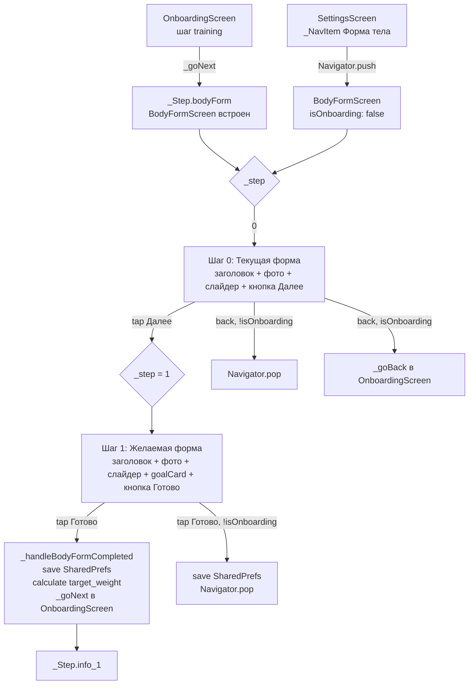

# ТЗ: Перенос BodyFormScreen из FitKeep в KayFit

**Дата:** 2026-05-06  
**Ветка:** `feat/body-form-port` (от HEAD `claude/hotfix-p0-feedback-2026-05-02`)  
**Статус HLD:** одобрен  
**Целевой репозиторий:** `/Users/user/Desktop/КУРСОР/mobileKayfit/`  
**Источник:** `/Users/user/Desktop/КУРСОР/FitKeepMobile/`

---

## Hard-Constraints для frontend-dev (читать первым)

### Запрещённые к редактированию файлы

Следующие 18 файлов редактируются параллельно в другой сессии. Трогать их ЗАПРЕЩЕНО ни в каком виде — не читать с целью изменить, не добавлять в индекс:

```
lib/core/i18n/app_en.arb
lib/core/i18n/app_ru.arb
lib/core/i18n/generated/app_localizations.dart
lib/core/i18n/generated/app_localizations_en.dart
lib/core/i18n/generated/app_localizations_ru.dart
lib/features/add_meal/screens/kf2_recognizing_screen.dart
lib/features/add_meal/screens/recognition_result_sheet_kf2.dart
lib/features/add_meal/widgets/kf2_item_tile.dart
lib/features/chat/screens/chat_v2_screen.dart
lib/features/dashboard/providers/dashboard_provider.dart
lib/features/dashboard/providers/dashboard_provider.g.dart
lib/features/journal/screens/edit_meal_screen.dart
lib/features/journal/screens/journal_v2_screen.dart
lib/features/settings/screens/goals_screen.dart
lib/router.dart
lib/shared/models/k2_meal_row_data.dart
lib/shared/widgets/kayfit2_meal_photo.dart
lib/shared/widgets/kayfit2_meal_row.dart
```

**Запрещены команды:** `git add -A`, `git add .`  
**Разрешены только явные:** `git add lib/features/body_form/...`, `git add assets/onboarding/...`, `git add pubspec.yaml`

### Допустимые для изменения файлы (полный список)

- `pubspec.yaml` — только секция `flutter: assets:`, ничего больше
- `assets/onboarding/body-form-*.jpg` — добавление 14 файлов (копирование, не изменение)
- `lib/features/body_form/**` — всё новое, директория создаётся с нуля
- `lib/features/settings/screens/settings_screen.dart` — добавить один `_NavItem` (точечная правка)
- `lib/features/settings/screens/settings_v2_screen.dart` — добавить один `_NavItem` (точечная правка), если файл существует
- `lib/features/onboarding/screens/onboarding_screen.dart` — добавить один шаг `_Step.bodyForm` и соответствующий handler

---

## 1. Цель фичи и сценарии использования

### Бизнес-смысл

BodyFormScreen позволяет пользователю выбрать текущую и желаемую форму тела из 7 визуальных вариантов. Выбор: (а) персонализирует онбординг визуально; (б) вычисляет `target_weight` через промежуточный fat% — что уточняет расчёт калорийного плана; (в) создаёт психологическую привязку к конкретному образу цели. Бэкенд KayFit не изменяется. Fat% — вспомогательная величина, существующая только на клиенте для расчёта `target_weight`.

### Acceptance Scenarios (Given / When / Then)

**SC-01. Онбординг — первый запуск**  
Given: пользователь только что выбрал пол `male` на шаге `gender` и продолжил онбординг  
When: онбординг достигает нового шага `bodyForm` (после `training`)  
Then: отображается `BodyFormScreen` с мужскими изображениями, слайдер в позиции 0, кнопка «Далее» активна

**SC-02. Онбординг — переключение на желаемую форму**  
Given: пользователь находится на шаге 0 (текущая форма), выбрал форму 3  
When: нажимает кнопку «Далее»  
Then: переход на шаг 1 «Желаемая форма», слайдер сброшен в 0, появляется карточка goal info, заголовок изменился на «Желаемая форма тела»

**SC-03. Онбординг — завершение (current == target)**  
Given: пользователь на шаге 1, выбрал ту же позицию слайдера что и на шаге 0  
When: нажимает «Готово»  
Then: выбор сохраняется в `SharedPreferences` с ключом `body_form_current` = `body_form_desired` = N; онбординг переходит к следующему шагу (следующий шаг после `bodyForm` — `info_1`); поле `targetWeight` в расчёте остаётся равным текущему весу пользователя (без изменений)

**SC-04. Settings — повторный вход**  
Given: пользователь авторизован и ранее проходил BodyFormScreen (ключи в SharedPreferences существуют)  
When: открывает Settings → нажимает «Форма тела»  
Then: открывается `BodyFormScreen` через `Navigator.push(MaterialPageRoute(...))`, на шаге 0 слайдер восстановлен в сохранённое значение `body_form_current`, на шаге 1 — `body_form_desired`

**SC-05. Женский гендер**  
Given: пользователь выбрал пол `female` в онбординге  
When: открывается `BodyFormScreen`  
Then: отображаются изображения `body-form-girl-1.jpg` … `body-form-girl-7.jpg`, и не отображаются мужские

**SC-06. Ошибка изображения**  
Given: ассет `body-form-3.jpg` недоступен (повреждён / не скопирован)  
When: экран рендерит карточку с изображением  
Then: вместо изображения отображается fallback — иконка `Icons.person_outline` в прямоугольнике цвета `AppColors.border`, высотой 280

**SC-07. Повторный онбординг не показывает BodyFormScreen**  
Given: `SharedPreferences` содержит ключи `body_form_current` и `body_form_desired`  
When: пользователь проходит онбординг повторно (флаг onboarding_done сброшен, например после dev-logout)  
Then: шаг `bodyForm` в онбординге восстанавливает ранее сохранённые значения слайдеров (не сбрасывает в 0)

---

## 2. UX-флоу

### Точки входа

| Точка | Путь навигации | Тип навигации |
|---|---|---|
| Онбординг | шаг `_Step.bodyForm` после `training` | inline step в `OnboardingScreen` (без отдельного маршрута) |
| Settings → «Форма тела» | `Navigator.push(MaterialPageRoute(...))` | modal поверх Settings |

### 2-шаговый внутренний переход

Шаг 0 и шаг 1 — не отдельные экраны, а состояния (`_step: int`) внутри одного `StatefulWidget`. Переход между ними — `setState(() => _step = 1)`.

- **Шаг 0 (текущая):** заголовок «Какая у тебя сейчас форма тела?», слайдер, изображение. Кнопка «Далее».
- **Шаг 1 (желаемая):** заголовок «Какая форма тела — твоя цель?», слайдер + карточка goal info под слайдером. Кнопка «Готово».

### Поведение после завершения

В контексте онбординга: вызывается `_handleBodyFormCompleted(currentSel, desiredSel)` → сохранение в SharedPreferences → вызов `_goNext()` → переход к `_Step.info_1`.

В контексте Settings: `Navigator.pop(context)`. Никаких push-уведомлений, celebration-экранов, изменений `showWayToGoalProvider`.

### Кнопка «Назад»

- Шаг 1 → шаг 0: `setState(() => _step = 0)`
- Шаг 0 в онбординге → `_goBack()` в онбординге (стандартный механизм)
- Шаг 0 в Settings → `Navigator.pop(context)` / `context.pop()` если `canPop()`

### Mermaid Flow



---

## 3. Структура компонентов

### 3.1 Директория

Все новые файлы размещаются в:
```
lib/features/body_form/
├── screens/
│   └── body_form_screen.dart   ← главный экран
├── i18n/
│   └── body_form_strings.dart  ← локализация (см. раздел 5)
└── body_form_prefs.dart        ← тонкая обёртка над SharedPreferences
```

### 3.2 Константы и маппинг fat%

Объявить в `body_form_screen.dart` как top-level константы:

```dart
// Маппинг: индекс слайдера (0-based) → процент жира
// Источник: way_to_goal_screen.dart FitKeep, _bodyFatMap (1-based там → 0-based здесь)
// shape index 0 → key 1 в FitKeep → 5.0%
const _kBodyFatByIndex = {
  0: 5.0,
  1: 8.5,
  2: 13.0,
  3: 19.5,
  4: 27.0,
  5: 35.5,
  6: 45.0,
};
```

Допущение: маппинг взят дословно из `FitKeepMobile/lib/features/way_to_goal/screens/way_to_goal_screen.dart`, константа `_bodyFatMap`. В FitKeep ключи 1-based (1..7), в KayFit индексы 0-based (0..6). Разница только в смещении ключа на 1.

### 3.3 Расчёт `target_weight` из выбранной формы

Формула применяется только если желаемая форма `desiredIndex` не равна текущей `currentIndex` и желаемый fat% ниже текущего (цель похудеть):

```
currentFat  = _kBodyFatByIndex[currentIndex]   // процент
desiredFat  = _kBodyFatByIndex[desiredIndex]   // процент
leanMass    = currentWeight * (1 - currentFat / 100)
targetWeight = leanMass / (1 - desiredFat / 100)
targetWeight = targetWeight.clamp(30.0, currentWeight)  // не может быть > текущего
```

Если `desiredIndex >= currentIndex` (пользователь хочет набрать или сохранить форму), `targetWeight` остаётся равным `currentWeight` или текущему `_targetWeight` из онбординга — не перезаписывается.

Результат `targetWeight` (если вычислен) обновляет поле `_targetWeight` в `_OnboardingScreenState` до вызова `_goNext()`. Это влияет на `_preview` (метод `_calcPreview`) и, следовательно, на `PlanResultView` в шаге `result`.

### 3.4 `body_form_prefs.dart`

Тонкая обёртка для изоляции ключей SharedPreferences:

```dart
abstract final class BodyFormPrefs {
  static const _kCurrent = 'body_form_current';  // int, 0-based index
  static const _kDesired = 'body_form_desired';  // int, 0-based index

  static Future<void> save({required int current, required int desired}) async {
    final prefs = await SharedPreferences.getInstance();
    await prefs.setInt(_kCurrent, current);
    await prefs.setInt(_kDesired, desired);
  }

  static Future<({int current, int desired})?> load() async {
    final prefs = await SharedPreferences.getInstance();
    final c = prefs.getInt(_kCurrent);
    final d = prefs.getInt(_kDesired);
    if (c == null || d == null) return null;
    return (current: c, desired: d);
  }

  static Future<void> clear() async {
    final prefs = await SharedPreferences.getInstance();
    await prefs.remove(_kCurrent);
    await prefs.remove(_kDesired);
  }
}
```

### 3.5 `BodyFormScreen` — интерфейс и параметры

```dart
class BodyFormScreen extends StatefulWidget {
  /// true — встроен в онбординг, false — открыт из Settings
  final bool isOnboarding;

  /// Пол пользователя: 'male' | 'female' | '' (пустая строка = male по умолчанию)
  final String gender;

  /// Начальное значение шага 0 (восстанавливается из SharedPreferences или онбординга)
  final int initialCurrent;

  /// Начальное значение шага 1
  final int initialDesired;

  /// Вызывается при завершении (шаг 1, кнопка Готово)
  /// [currentIndex] — 0-based, [desiredIndex] — 0-based, [targetWeight] — null если не вычисляется
  final void Function(int currentIndex, int desiredIndex, double? targetWeight)? onCompleted;

  const BodyFormScreen({
    super.key,
    this.isOnboarding = true,
    required this.gender,
    this.initialCurrent = 0,
    this.initialDesired = 0,
    this.onCompleted,
  });
}
```

### 3.6 Внутренние виджеты `BodyFormScreen`

Все приватные, объявлены в том же файле:

| Виджет / метод | Ответственность |
|---|---|
| `_buildHeader()` | Кнопка назад + линейный прогресс-индикатор (OBColors.pink / OBColors.border) |
| `_buildContent()` | Заголовок + `AnimatedSwitcher` с фото + `_buildSlider()` + `_buildGoalCard()` (шаг 1) + кнопка |
| `_buildSlider()` | Кастомный слайдер с 7 точками, трек, thumb |
| `_buildGoalCard()` | Информационная карточка fat%-диапазона (только на шаге 1) |
| `_handleNext()` | Переход шаг 0→1 или завершение: сохранение prefs, вызов `onCompleted`, навигация |
| `_handleBack()` | Шаг 1→0 или pop |

### 3.7 Дизайн-токены: замена FitKeep-хардкодов

| FitKeep хардкод | Роль | KayFit-замена |
|---|---|---|
| `Color(0xFF4E7EFB)` | Primary blue | `AppColors.accent` (`Color(0xFF007AFF)`) |
| `Color(0xFFDBEAFE)` | Light blue bg (трек, карточка) | `AppColors.accentSoft` (`Color(0xFFDCEEFF)`) |
| `Color(0xFF374151)` | Dark button bg | `AppColors.text` (`Color(0xFF111827)`) |
| `Color(0xFF3C3C3C)` | Text dark | `AppColors.text` |
| `Color(0xFF362F41)` | Header icon | `AppColors.text` |
| `Colors.white` scaffold bg | Фон | онбординг: `OBColors.bg`; settings: `AppColors.bg` |
| `Color(0xFFD1D5DB)` | Неактивная точка рамка | `AppColors.border` |
| `Color(0xFF16A34A)` | Safe range зелёный | оставить `Color(0xFF16A34A)` (совпадает с accent icon KayFit) |
| `Color(0xFFDC6E26)` | Unsafe range оранжевый | `AppColors.warm` (`Color(0xFFEA580C)`) |
| `Color(0xFFEFEDEE)` | Fallback bg | `AppColors.border` |
| `Color(0xFFAAB2BD)` | Fallback icon | `AppColors.textMuted` |

Прогресс-индикатор заголовка: цвет `OBColors.pink` (заполненный), `OBColors.border` (фон) — совпадает с онбординг-стилем KayFit.

### 3.8 Связь с онбордингом KayFit

**Где читается gender:** `_OnboardingScreenState._gender` — String `'male'` | `'female'` | `''`. Передаётся в `BodyFormScreen(gender: _gender)`.

**Где добавляется шаг:**

Файл: `lib/features/onboarding/screens/onboarding_screen.dart`

1. В enum `_Step` добавить:
   ```dart
   // ignore: constant_identifier_names
   body_form,
   ```
   Позиция в enum: после `training`, до `weight_loss_info`.

2. В `_buildStepList()` добавить:
   ```dart
   _Step.body_form,
   ```
   После `_Step.training`, до `if (_goals.contains('lose_weight')) _Step.weight_loss_info`.

3. Новый handler в `_OnboardingScreenState`:
   ```dart
   void _handleBodyFormCompleted(int currentIdx, int desiredIdx, double? calcTargetWeight) {
     // Обновить targetWeight только если вычисленный < текущего
     if (calcTargetWeight != null && calcTargetWeight < (_targetWeight ?? double.infinity)) {
       _targetWeight = calcTargetWeight;
       _targetWeightCtrl.text = calcTargetWeight.toStringAsFixed(0);
     }
     _savePending();
     _goNext();
   }
   ```

4. В `_buildStepContent()`, секция `case _Step.body_form:`:
   ```dart
   case _Step.body_form:
     return BodyFormScreen(
       isOnboarding: true,
       gender: _gender,
       initialCurrent: 0,  // TODO: восстанавливать из SharedPrefs (SC-07)
       initialDesired: 0,
       onCompleted: _handleBodyFormCompleted,
     );
   ```
   
   Допущение SC-07: при первом запуске онбординга восстановление значений из SharedPrefs в шаге `body_form` должно быть добавлено в `_restoreAnswers()` через ключи `body_form_current` / `body_form_desired`. Это расширение `_restoreAnswers` — оно безопасно, ключи не пересекаются с locked-файлами.

5. В `_buildFooter()` — шаг `body_form` не нуждается в CTA от OnboardingScaffold. `BodyFormScreen` сам рендерит кнопки. Footer должен вернуть `_FooterCtaData` с пустым виджетом:
   ```dart
   case _Step.body_form:
     return _FooterCtaData(primaryCta: const SizedBox.shrink());
   ```
   Это позволяет `BodyFormScreen` занять весь экран без дублирующей кнопки снизу.

**Важно:** `BodyFormScreen` при `isOnboarding: true` НЕ вызывает навигацию сам. Он вызывает `onCompleted` колбэк, который живёт в `_OnboardingScreenState`. Шаг вперёд делает только `_goNext()`.

### 3.9 Связь с Settings

Файл: `lib/features/settings/screens/settings_screen.dart`

Добавить `_NavItem` в первый `_SectionCard` (рядом с `settings_goals`):

```dart
_NavItem(
  icon: Icons.accessibility_new_rounded,
  iconColor: AppColors.accent,
  iconBg: AppColors.accentSoft,
  label: BodyFormStrings.settingsLabel(isRu),
  onTap: () async {
    final saved = await BodyFormPrefs.load();
    if (!context.mounted) return;
    Navigator.push(
      context,
      MaterialPageRoute(
        builder: (_) => BodyFormScreen(
          isOnboarding: false,
          gender: user?.gender ?? '',   // TODO: gender из профиля (см. раздел 11)
          initialCurrent: saved?.current ?? 0,
          initialDesired: saved?.desired ?? 0,
        ),
      ),
    );
  },
),
```

То же — в `settings_v2_screen.dart` если файл существует.

---

## 4. Расчёт `target_weight` из выбранной формы (детали)

### Формула (цитата из FitKeep `way_to_goal_screen.dart`)

В FitKeep маппинг объявлен как:
```dart
const _bodyFatMap = {
  1: 5.0,   // форма 1 → 5% жира
  2: 8.5,
  3: 13.0,
  4: 19.5,
  5: 27.0,
  6: 35.5,
  7: 45.0,
};
```

KayFit использует 0-based индексы (сдвиг -1 по ключу). Сам расчёт `weight_loss_date` в FitKeep делал бэкенд. В KayFit бэкенд не меняется. Формула на клиенте:

```
leanMass     = currentWeight × (1 - currentFat / 100)
targetWeight = leanMass / (1 - desiredFat / 100)
targetWeight = targetWeight.clamp(30.0, currentWeight - 0.5)
```

Граничное условие `.clamp(30.0, currentWeight - 0.5)` — целевой вес не может превышать текущий при похудении (минус 0.5 кг чтобы избежать флоат-равенства).

### Edge-case: current == desired (одна и та же форма)

Если `desiredIndex == currentIndex`:
- `onCompleted` вызывается с `targetWeight = null`
- `_targetWeight` в онбординге не изменяется
- Никакого предупреждения пользователю не показывается — считается нормальным выбором (поддержание формы)

### Edge-case: желаемая форма > текущей (набор массы)

Если `desiredIndex > currentIndex`:
- Желаемый fat% > текущего
- `targetWeight = null` (логика набора массы — вне скоупа фичи)
- `onCompleted` вызывается с `targetWeight = null`
- `_targetWeight` в онбординге не изменяется

---

## 5. Локализация

### Стратегия

`app_en.arb` и `app_ru.arb` — заблокированы. Решение: создать локальный класс `BodyFormStrings` в `lib/features/body_form/i18n/body_form_strings.dart`. Класс не зависит от `AppLocalizations`. Позже, когда ARB-файлы разблокируют, строки переносятся в них обычным способом и `BodyFormStrings` удаляется.

### Файл `lib/features/body_form/i18n/body_form_strings.dart`

```dart
abstract final class BodyFormStrings {
  static String currentQuestion(bool isRu) =>
    isRu ? 'Какая у тебя сейчас форма тела?' : 'What is your current body shape?';

  static String desiredQuestion(bool isRu) =>
    isRu ? 'Какая форма тела — твоя цель?' : 'What body shape is your goal?';

  static String nextButton(bool isRu) =>
    isRu ? 'Далее' : 'Next';

  static String finishButton(bool isRu) =>
    isRu ? 'Готово' : 'Done';

  static String sliderLean(bool isRu) =>
    isRu ? 'Стройное' : 'Lean';

  static String sliderCurvy(bool isRu) =>
    isRu ? 'Полное' : 'Curvy';

  static String goalLabel(bool isRu) =>
    isRu ? 'Цель' : 'Goal';

  static String sendError(bool isRu) =>
    isRu ? 'Не удалось сохранить выбор. Попробуй ещё раз.' : 'Could not save your choice. Please try again.';

  static String settingsLabel(bool isRu) =>
    isRu ? 'Форма тела' : 'Body Shape';

  // Goal info titles (индексы 0–6 соответствуют слайдеру)
  static String goalTitle(int index, bool isRu) {
    if (index <= 2) return isRu ? 'Атлетическое' : 'Athletic';
    if (index == 3) return isRu ? 'Нормальное' : 'Normal';
    return isRu ? 'Рекомендуем консультацию' : 'Consultation recommended';
  }

  static String goalDesc(int index, bool isRu) {
    if (index <= 2) {
      return isRu
          ? 'Низкий процент жира, хорошо очерченные мышцы.'
          : 'Low body fat, well-defined muscles.';
    }
    if (index == 3) {
      return isRu
          ? 'Здоровый диапазон для большинства людей.'
          : 'Healthy range for most people.';
    }
    return isRu
        ? 'Рекомендуем проконсультироваться с врачом перед постановкой цели.'
        : 'We recommend consulting a doctor before setting this as your goal.';
  }

  static String goalRange(int index) => switch (index) {
        0 => '4%–6%',
        1 => '7%–10%',
        2 => '11%–15%',
        3 => '16%–23%',
        4 => '24%–30%',
        5 => '31%–40%',
        _ => '>40%',
      };

  static bool goalIsSafe(int index) => index <= 3;
}
```

**Использование в `BodyFormScreen`:** получать `isRu` через `Localizations.localeOf(context).languageCode == 'ru'`. Не требует `AppLocalizations`.

---

## 6. Маршрутизация

### Проблема

`lib/router.dart` — заблокирован. Маршрут `/body-form` нельзя добавить в `GoRouter` сейчас.

### Рекомендуемое решение: `Navigator.push` (MaterialPageRoute)

Для входной точки Settings использовать `Navigator.push(context, MaterialPageRoute(builder: (_) => BodyFormScreen(...)))`. Это стандартная практика для вспомогательных экранов, не нуждающихся в deep-link навигации. Результат: экран открывается поверх Settings как модальная страница с системной кнопкой «назад».

Для входной точки онбординга: `BodyFormScreen` встроен как шаг в `OnboardingScreen`, маршрут не нужен вообще.

Таким образом, `/body-form` как `GoRoute` не является обязательным для данной реализации.

### Альтернативное решение: дождаться разблокировки router.dart

Если в будущем потребуется deep-link `/body-form` (например для навигации из push-уведомления), то после разблокировки `router.dart` добавить:
```dart
GoRoute(
  path: '/body-form',
  builder: (context, state) => BodyFormScreen(
    isOnboarding: false,
    gender: state.uri.queryParameters['gender'] ?? '',
    initialCurrent: int.tryParse(state.uri.queryParameters['current'] ?? '') ?? 0,
    initialDesired: int.tryParse(state.uri.queryParameters['desired'] ?? '') ?? 0,
  ),
),
```
И добавить `/body-form` в список `isPublic` (или оставить приватным).

### Почему не sub-router

`go_router` не поддерживает динамическое добавление дочерних маршрутов без изменения корневого `GoRouter`. Создание `lib/features/body_form/router.dart` с `ShellRoute` невозможно без правки `router.dart`. Поэтому sub-router отклонён.

---

## 7. Ассеты

### Список 14 файлов для копирования

Источник (канонические, не из `build/`):
```
/Users/user/Desktop/КУРСОР/FitKeepMobile/assets/onboarding/body-form-1.jpg
/Users/user/Desktop/КУРСОР/FitKeepMobile/assets/onboarding/body-form-2.jpg
/Users/user/Desktop/КУРСОР/FitKeepMobile/assets/onboarding/body-form-3.jpg
/Users/user/Desktop/КУРСОР/FitKeepMobile/assets/onboarding/body-form-4.jpg
/Users/user/Desktop/КУРСОР/FitKeepMobile/assets/onboarding/body-form-5.jpg
/Users/user/Desktop/КУРСОР/FitKeepMobile/assets/onboarding/body-form-6.jpg
/Users/user/Desktop/КУРСОР/FitKeepMobile/assets/onboarding/body-form-7.jpg
/Users/user/Desktop/КУРСОР/FitKeepMobile/assets/onboarding/body-form-girl-1.jpg
/Users/user/Desktop/КУРСОР/FitKeepMobile/assets/onboarding/body-form-girl-2.jpg
/Users/user/Desktop/КУРСОР/FitKeepMobile/assets/onboarding/body-form-girl-3.jpg
/Users/user/Desktop/КУРСОР/FitKeepMobile/assets/onboarding/body-form-girl-4.jpg
/Users/user/Desktop/КУРСОР/FitKeepMobile/assets/onboarding/body-form-girl-5.jpg
/Users/user/Desktop/КУРСОР/FitKeepMobile/assets/onboarding/body-form-girl-6.jpg
/Users/user/Desktop/КУРСОР/FitKeepMobile/assets/onboarding/body-form-girl-7.jpg
```

Целевая папка: `/Users/user/Desktop/КУРСОР/mobileKayfit/assets/onboarding/`

Команда копирования:
```bash
cp /Users/user/Desktop/КУРСОР/FitKeepMobile/assets/onboarding/body-form*.jpg \
   /Users/user/Desktop/КУРСОР/mobileKayfit/assets/onboarding/
```

### Регистрация в `pubspec.yaml`

Текущее состояние секции `flutter: assets:` в `mobileKayfit/pubspec.yaml`:
```yaml
flutter:
  uses-material-design: true
  generate: true
  assets:
    - assets/icon/
```

Добавить строку (только эту, ничего более в файле не менять):
```yaml
flutter:
  uses-material-design: true
  generate: true
  assets:
    - assets/icon/
    - assets/onboarding/
```

После добавления: `flutter pub get` для обновления ассет-манифеста.

---

## 8. Тесты

Расположение тестов: `test/features/body_form/`

### 8.1 Unit-тест маппинга shape → fat% → target_weight

Файл: `test/features/body_form/body_form_calculation_test.dart`

```dart
// Проверить все 7 форм при currentWeight = 80.0, gender не влияет на формулу
void main() {
  group('BodyFormCalculation', () {
    const weights = {
      0: 5.0,
      1: 8.5,
      2: 13.0,
      3: 19.5,
      4: 27.0,
      5: 35.5,
      6: 45.0,
    };

    test('маппинг fat% корректен для всех 7 форм', () {
      for (var i = 0; i < 7; i++) {
        expect(_kBodyFatByIndex[i], equals(weights[i]));
      }
    });

    test('target_weight рассчитывается правильно для формы 0→форма 4', () {
      // current: index 4 (27%), desired: index 0 (5%)
      const cw = 80.0;
      const cf = 27.0;
      const df = 5.0;
      final leanMass = cw * (1 - cf / 100);
      final expected = (leanMass / (1 - df / 100)).clamp(30.0, cw - 0.5);
      expect(calcTargetWeight(currentWeight: cw, currentIndex: 4, desiredIndex: 0),
          closeTo(expected, 0.01));
    });

    test('target_weight = null если desired >= current (нет похудения)', () {
      expect(calcTargetWeight(currentWeight: 70.0, currentIndex: 2, desiredIndex: 2), isNull);
      expect(calcTargetWeight(currentWeight: 70.0, currentIndex: 2, desiredIndex: 5), isNull);
    });

    // 7 тест-кейсов для всех форм при currentWeight=80, current=6 (самый высокий fat):
    for (var i = 0; i < 6; i++) {
      test('target_weight не null для desired=$i < current=6', () {
        expect(calcTargetWeight(currentWeight: 80.0, currentIndex: 6, desiredIndex: i),
            isNotNull);
      });
    }

    test('target_weight clamp: не выходит за 30 кг снизу', () {
      // Крайний случай: очень лёгкий человек
      final result = calcTargetWeight(currentWeight: 32.0, currentIndex: 6, desiredIndex: 0);
      if (result != null) expect(result, greaterThanOrEqualTo(30.0));
    });
  });
}
```

Требование: экспортировать публичную функцию `calcTargetWeight({required double currentWeight, required int currentIndex, required int desiredIndex}) → double?` из `body_form_screen.dart` или отдельного файла `lib/features/body_form/body_form_calc.dart` (предпочтительно — для тестируемости).

### 8.2 Widget-тест BodyFormScreen

Файл: `test/features/body_form/body_form_screen_test.dart`

Тест-кейсы:

| ID | Описание | Ожидание |
|---|---|---|
| WT-01 | Шаг 0 рендерит заголовок «текущая» | `find.text(BodyFormStrings.currentQuestion(false))` — 1 вхождение |
| WT-02 | 7 точек слайдера | `find.byType(GestureDetector)` среди dots — 7 штук (через key-маркировку каждого dot) |
| WT-03 | Мужские изображения при `gender='male'` | `find.byWidgetPredicate(w => w is Image && (w.image as AssetImage).assetName.contains('body-form-') && !includes('-girl-'))` |
| WT-04 | Женские изображения при `gender='female'` | то же, содержит `-girl-` |
| WT-05 | Tap точки 3 → `_currentSelected = 3` | после `tester.tap(find.byKey(Key('dot-0-3')))` и `pump()` — изображение переключилось (`AnimatedSwitcher`) |
| WT-06 | Кнопка «Далее» → шаг 1, появляется goalCard | `find.text(BodyFormStrings.desiredQuestion(false))` — 1 вхождение |
| WT-07 | `onCompleted` вызван с правильными параметрами | `tester.tap(finishButton)` → `onCompleted` вызван с `(currentIndex, desiredIndex, calcTargetWeight(...))` |
| WT-08 | Fallback при ошибке ассета | errorBuilder рендерит `Icon(Icons.person_outline)` |
| WT-09 | Кнопка назад на шаге 1 → шаг 0 | после tap back — заголовок «текущая» |

Шаблон теста:
```dart
testWidgets('WT-01: шаг 0 показывает заголовок текущей формы', (tester) async {
  await tester.pumpWidget(
    MaterialApp(
      home: BodyFormScreen(
        isOnboarding: false,
        gender: 'male',
        onCompleted: (_, __, ___) {},
      ),
    ),
  );
  await tester.pump();
  expect(find.text(BodyFormStrings.currentQuestion(false)), findsOneWidget);
});
```

### 8.3 Integration-тест: онбординг → BodyForm → PlanResultView

Файл: `integration_test/flows/body_form_onboarding_test.dart`

```dart
// Given: свежий запуск, onboarding_done = false
// When: пользователь проходит онбординг до шага body_form
// Then: 7 карточек форм отображаются, слайдер работает
// And: после tap Готово — шаг переходит к info_1
// And: в шаге result PlanResultView показывает targetWeight != null
```

Реализация интеграционного теста — через `ProviderScope` с overrides на `SharedPreferences` (fake) и `authNotifierProvider` (unauthenticated state). Полный E2E через реальный бэкенд — вне скоупа этого ТЗ.

---

## 9. Acceptance Criteria для QA

### AC-01 — 7 карточек форм
- [ ] Слайдер содержит ровно 7 кликабельных точек
- [ ] Каждая точка меняет изображение (проверить все 7 позиций вручную)
- [ ] Изображение анимировано при переключении (`AnimatedSwitcher`, 250ms)

### AC-02 — Гендерная зависимость
- [ ] При `gender='male'` отображаются `body-form-1.jpg` … `body-form-7.jpg`
- [ ] При `gender='female'` отображаются `body-form-girl-1.jpg` … `body-form-girl-7.jpg`
- [ ] При `gender=''` отображаются мужские (default)

### AC-03 — 2-шаговый флоу
- [ ] Шаг 0: нет goalCard; заголовок = «текущая»; кнопка «Далее»
- [ ] Шаг 1: есть goalCard с диапазоном fat%; заголовок = «желаемая»; кнопка «Готово»
- [ ] Назад со шага 1 → шаг 0, слайдер в шаге 0 сохранил ранее выбранную позицию

### AC-04 — Сохранение в SharedPreferences
- [ ] После завершения BodyFormScreen в `SharedPreferences` есть ключи `body_form_current` и `body_form_desired`
- [ ] При повторном открытии из Settings слайдеры восстановлены в сохранённые значения

### AC-05 — Влияние на PlanResultView
- [ ] Если desiredIndex < currentIndex: `PlanResultView` в шаге `result` онбординга показывает `targetWeight` ≠ `_targetWeight` из шага weight (он уменьшен)
- [ ] Если desiredIndex == currentIndex: `PlanResultView` показывает `targetWeight` = то, что было введено на шаге weight

### AC-06 — Settings точка входа
- [ ] В `SettingsScreen` присутствует пункт «Форма тела» / «Body Shape»
- [ ] Нажатие открывает `BodyFormScreen` поверх Settings
- [ ] После `Navigator.pop` (кнопка назад или системная) Settings видимы без перезагрузки

### AC-07 — Дизайн-токены
- [ ] Нет захардкоженных hex-цветов FitKeep (`0xFF4E7EFB`, `0xFF374151`, `0xFFDBEAFE`) в новых файлах
- [ ] Фон экрана в онбординге: `OBColors.bg` (кремовый `0xFFFFF1EA`)
- [ ] Фон экрана в Settings: `AppColors.bg` (`0xFFF4F6F8`)

### AC-08 — Fallback изображения
- [ ] При недоступном ассете отображается placeholder с иконкой, без краша

### AC-09 — Не затронуты locked-файлы
- [ ] `git diff --name-only` в коммите содержит ТОЛЬКО файлы из раздела «Допустимые для изменения»

### AC-10 — Локализация
- [ ] Все строки экрана на EN корректны при `locale=en`
- [ ] Все строки экрана на RU корректны при `locale=ru`
- [ ] Нет пустых или `null` строк в UI

---

## 10. Открытые вопросы

### ОВ-1 (КРИТИЧНО) — Gender из профиля в Settings

В `SettingsScreen` для входа из Settings нужен `gender` пользователя. Текущая модель `UserProfile` (`lib/shared/models/user_profile.dart`) не содержит поля `gender` — там только `id`, `email`, `username`, `telegramId`, `isActive`. 

Возможные решения:
- A. Читать `gender` из `SharedPreferences` по ключу `body_form_gender` (сохранять при прохождении онбординга)
- B. Читать `gender` из ключа `onboarding_answers` (уже сохраняется, см. `_saveProgress`)
- C. Расширить `UserProfile.fromJson` полем `gender` если бэкенд его возвращает в `/api/profile`

Рекомендация до выяснения: вариант B — парсить `onboarding_answers` из SharedPreferences, ключ `gender`. Это не требует изменений бэкенда.

**Требует ответа от пользователя перед реализацией Settings-точки входа.**

### ОВ-2 — Соответствие fat%-маппинга между FitKeep и KayFit-бэком

Маппинг `_kBodyFatByIndex` взят из `way_to_goal_screen.dart` FitKeep. Неизвестно, ожидает ли `/api/calculate` в KayFit-бэке те же значения fat% или собственные. Поскольку fat% на клиенте не передаётся в `/api/calculate` (бэк KayFit не имеет этого параметра), расхождение некритично для текущего скоупа. Но если в будущем fat% будет добавлен в `/api/calculate`, маппинг потребует синхронизации с бэком.

### ОВ-3 — Анимация прогресс-бара в онбординге

В онбординге шаг `body_form` встроен как inline-контент. `BodyFormScreen` рендерит собственный header с прогресс-индикатором. При этом `OnboardingScaffold` тоже показывает свой прогресс-индикатор в `_buildHeader()`. Это создаёт дублирование. Рекомендация: при `isOnboarding: true` BodyFormScreen не должен рендерить собственный header (`_buildHeader()` возвращает `const SizedBox.shrink()`). Прогресс-индикатор обеспечивает онбординг-скаффолд.

Требует решения перед реализацией: подтвердить, нужен ли собственный header в BodyFormScreen при isOnboarding=true.

### ОВ-4 — Скоуп `_canSkip` в онбординге

Текущая логика `_canSkip`: `_stepIndex >= 1 && _stepIndex <= 8`. После добавления `body_form` между `training` (индекс ~10) и `weight_loss_info`, этот диапазон не покрывает `body_form`. Нужно уточнить, должен ли шаг `body_form` быть пропускаемым. По умолчанию — нет (скип недоступен).

### ОВ-5 — Флаг «экран пройден» для онбординга

SC-07 требует, чтобы при повторном онбординге значения слайдеров восстанавливались. Реализовано через `BodyFormPrefs.load()` в `_restoreAnswers`. Но если пользователь никогда не проходил BodyFormScreen (первый запуск нового KayFit без FitKeep-истории), `load()` вернёт `null`, и слайдеры стартуют в 0 — это корректное поведение. Флаг «пройден» отдельно не нужен.

---

## 11. Допущения (зафиксированные)

1. **Бэкенд KayFit не меняется.** Fat% — вычислительная переменная только на клиенте.
2. **`shared_preferences: ^2.2.0` уже есть в `pubspec.yaml` KayFit** — дополнительная зависимость не нужна.
3. **`gender` из `onboarding_answers` в SharedPreferences** — достаточно для нужд Settings-точки входа (до разблокировки `UserProfile`).
4. **`_kBodyFatByIndex` — 0-based** (FitKeep использует 1-based в API `question_id 1101/1102`, KayFit не делает API-вызовов).
5. **Ассеты копируются из `FitKeepMobile/assets/onboarding/`** (не из build-директорий).
6. **В онбординге BodyFormScreen не получает данные возраст/вес/рост из SharedPreferences** — эти данные уже живут в `_OnboardingScreenState` и передаются через `_targetWeight` колбэк.
7. **`BodyFormScreen` — `StatefulWidget`, не `ConsumerStatefulWidget`** — Riverpod не нужен, нет обращений к `ref`.
