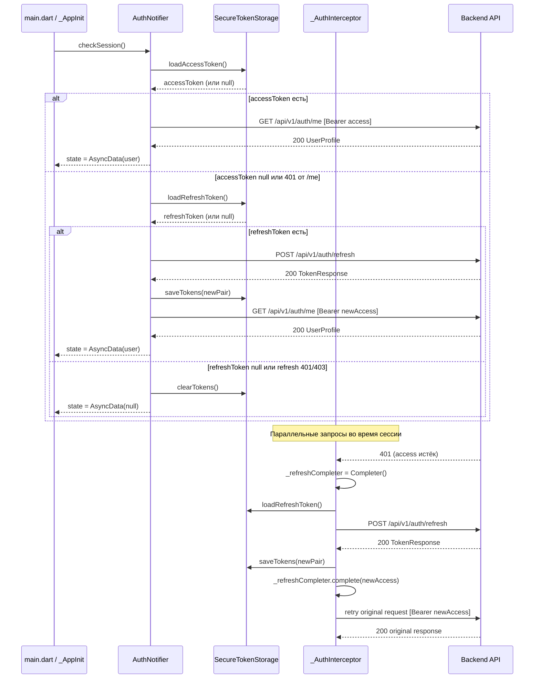

# ТЗ — Ось A: Auth Persistence (тикеты P0-1.1 + P0-1.2)
> Версия: 1.0  
> Дата: 2026-05-02  
> Автор: system-analyst agent  
> Основание: HLD_hotfix_p0_2026-05-02.md §«Тикет 1.1 + 1.2», ТЗ_исправления_первый_запуск.md §1.1 §1.2  
> Оценка трудозатрат: 6 ч фронт, 0 ч бэк  

---

## Содержание

1. Модели данных
2. Архитектура слоя auth
3. Контракт API
4. Сценарии (use cases)
5. Edge cases
6. Файлы для правки / создания
7. Тестовая стратегия
8. Acceptance checklist
9. Open questions

---

## 1. Модели данных

### 1.1 TokenPair

Хранится в `flutter_secure_storage`. Источник данных — ответ `POST /api/v1/auth/login` и `POST /api/v1/auth/refresh`.

```dart
// lib/core/auth/token_pair.dart — новый файл
@freezed
class TokenPair with _$TokenPair {
  const factory TokenPair({
    required String accessToken,
    required String refreshToken,
    required DateTime expiresAt,   // вычислять: DateTime.now().add(Duration(seconds: expires_in))
  }) = _TokenPair;

  factory TokenPair.fromApiResponse(Map<String, dynamic> json) => TokenPair(
    accessToken:  json['access_token']  as String,
    refreshToken: json['refresh_token'] as String,
    expiresAt:    DateTime.now().add(Duration(seconds: json['expires_in'] as int)),
  );
}
```

Маппинг с `TokenResponse` (openapi.json `#/components/schemas/TokenResponse`):

| Поле API      | Тип API | Поле TokenPair | Примечание |
|---------------|---------|----------------|------------|
| access_token  | String  | accessToken    | JWT         |
| refresh_token | String  | refreshToken   | opaque или JWT |
| token_type    | String  | —              | всегда "bearer", не сохраняем |
| expires_in    | Integer | expiresAt      | секунды от now() |

Допущение: `expires_in` — время жизни access token в секундах относительно момента ответа. Точка отсчёта — момент получения ответа клиентом, не бэком. Это дёшевле, чем Clock Skew mitigation, и безопаснее (клиент чуть раньше начнёт refresh).

Сериализация `TokenPair` в SecureStorage — в формате JSON (через `jsonEncode` / `jsonDecode`). Либо хранить три ключа отдельно (см. раздел 2.1).

---

### 1.2 OnboardingProgress

Схема в `SharedPreferences` (не Keychain — данные не секретны):

| Ключ SharedPreferences     | Тип    | Значение                                         | Когда пишем |
|----------------------------|--------|--------------------------------------------------|-------------|
| `onboarding_done`          | bool   | true после завершения онбординга                 | существует  |
| `onboarding_current_step`  | String | Имя шага из enum `_Step` (напр. `"age"`)         | После каждого перехода вперёд в OnboardingScreen |
| `onboarding_answers`       | String | JSON-строка `Map<String, dynamic>` всех ответов  | После каждого заполненного поля |
| `cached_user`              | String | JSON-строка `UserProfile`                        | существует  |

Ключи сохраняются инкрементально: при каждом `_goNext()` в `OnboardingScreen` записывается `onboarding_current_step` + `onboarding_answers`. При kill-restore — `onboarding_current_step` используется для восстановления позиции в flow.

При завершении онбординга (`markOnboardingDone`) — `onboarding_current_step` и `onboarding_answers` не удаляются (нужны для возможного повторного использования). Чистить только при явном logout.

---

## 2. Архитектура слоя auth

### 2.1 SecureTokenStorage

**Файл:** `lib/core/auth/secure_token_storage.dart` (новый)

Обёртка над `flutter_secure_storage: ^9.0.0`. Хранит три ключа отдельно (не JSON-объект) — чтобы обращаться к access token без десериализации всей пары.

```dart
abstract interface class SecureTokenStorage {
  Future<void> saveTokens(TokenPair pair);
  Future<TokenPair?> loadTokens();
  Future<String?> loadAccessToken();
  Future<String?> loadRefreshToken();
  Future<void> clearTokens();
}

// Реализация через flutter_secure_storage
class SecureTokenStorageImpl implements SecureTokenStorage { ... }
```

Ключи SecureStorage:

| Ключ                    | Содержимое           |
|-------------------------|----------------------|
| `kayfit.access_token`   | String (JWT)         |
| `kayfit.refresh_token`  | String               |
| `kayfit.expires_at`     | ISO-8601 строка      |

Параметры инициализации `FlutterSecureStorage`:

```dart
const FlutterSecureStorage(
  iOptions: IOSOptions(
    accessibility: KeychainAccessibility.first_unlock,  // доступно после первой разблокировки
  ),
  aOptions: AndroidOptions(
    encryptedSharedPreferences: true,
  ),
);
```

`KeychainAccessibility.first_unlock` — токен доступен сразу после первой разблокировки устройства, в том числе при фоновом refresh. `first_unlock_this_device` — более строгий вариант; если бэкап не требуется, предпочтительнее.

Допущение: используем `first_unlock`. Если продукт требует восстановления токена из iCloud Backup — использовать `unlocked` (менее безопасно).

---

### 2.2 AuthInterceptor

**Файл:** `lib/core/api/api_client.dart` (правка — `_AuthInterceptor` уже существует)

Текущая реализация корректна архитектурно (Completer-based mutex для параллельных 401). Требуется одно изменение: заменить `TokenStorage.getAccess()` / `TokenStorage.save()` / `TokenStorage.clear()` на вызовы `SecureTokenStorage`. Бизнес-логика interceptor'а не меняется.

Контракт interceptor'а:

1. `onRequest`: если путь не в `_isAuthPath`, читает `SecureTokenStorage.loadAccessToken()` и добавляет заголовок `Authorization: Bearer <token>`.
2. `onError` при статусе 401:
   - Если путь в `_isAuthPath` — пропускает (`handler.next(err)`).
   - Если уже идёт refresh (`_refreshCompleter != null`) — ждёт его завершения, затем повторяет запрос с новым токеном.
   - Если refresh не идёт — запускает refresh: `POST /api/v1/auth/refresh {refresh_token}`, сохраняет новую пару в `SecureTokenStorage`, завершает Completer, повторяет запрос.
   - Если refresh упал — `SecureTokenStorage.clearTokens()` + `_onLogout?.call()`.

---

### 2.3 Riverpod-провайдеры

**Файл:** `lib/core/auth/auth_provider.dart` (правка)

Изменение: метод `checkSession` использует `SecureTokenStorage` вместо `TokenStorage`.

```dart
// Добавить провайдер для SecureTokenStorage
@riverpod
SecureTokenStorage secureTokenStorage(Ref ref) => SecureTokenStorageImpl();
```

Метод `loginWithTokens(String access, String refresh)` принимает сырые строки из ответа регистрации/логина → конструирует `TokenPair` → вызывает `secureTokenStorage.saveTokens(pair)`.

Метод `logout()` вызывает `secureTokenStorage.clearTokens()` вместо `TokenStorage.clear()`.

**Файл:** `lib/router.dart` (правка) — `TokenStorage` заменить на `SecureTokenStorage` если используется напрямую.

---

### 2.4 Диаграмма взаимодействия



---

### 2.5 Bootstrap (main.dart)

`main.dart` уже реализует bootstrap — загружает `cached_user` из SharedPreferences и вызывает `checkSession()`. После миграции на `SecureTokenStorage` единственное изменение: `initApiClient()` получает экземпляр `SecureTokenStorage` через DI (либо создаётся внутри `initApiClient` и экспортируется как singleton).

`TokenStorage` (текущий класс в `api_client.dart`) сохраняется только для миграции — см. раздел 5.6.

---

## 3. Контракт API

Все эндпоинты задокументированы в `openapi.json`. Ниже — клиентски-значимые детали.

---

### 3.1 POST /api/v1/auth/login

**Request body** (`EmailLoginRequest`):

```json
{
  "email":     "string (required)",
  "password":  "string (required)",
  "device_id": "string | null (optional)"
}
```

**Headers:** `Content-Type: application/json`

**Responses:**

| Статус | Тело | Поведение клиента |
|--------|------|-------------------|
| 200 | `TokenResponse` | Сохранить `TokenPair` в `SecureTokenStorage`, вызвать `loginWithTokens` |
| 422 | `HTTPValidationError` | Показать ошибку валидации пользователю |
| Network | — | Показать "Нет подключения", retry-кнопка |

---

### 3.2 POST /api/v1/auth/refresh

**Request body** (`RefreshRequest`):

```json
{
  "refresh_token": "string (required)"
}
```

**Headers:** `Content-Type: application/json`. Без `Authorization` заголовка.

**Responses:**

| Статус | Тело | Поведение клиента |
|--------|------|-------------------|
| 200 | `TokenResponse` | Обновить `TokenPair` в `SecureTokenStorage` |
| 401 | — | Refresh-токен инвалиден → `clearTokens()` + редирект на логин |
| 422 | `HTTPValidationError` | Treat как 401 (невалидный токен) → logout |
| Network timeout | — | Показать snackbar "Проверьте подключение", не разлогинивать немедленно |

Допущение: бэкенд при `/refresh` возвращает 401 (а не 403) при невалидном/протухшем refresh-токене. Если бэкенд возвращает 403 — клиент обрабатывает оба кода одинаково.

---

### 3.3 POST /api/v1/auth/logout

**Request body** (`RefreshRequest`):

```json
{
  "refresh_token": "string (required)"
}
```

**Responses:**

| Статус | Тело | Поведение клиента |
|--------|------|-------------------|
| 204 | — | `clearTokens()`, `state = null`, редирект на онбординг/логин |
| 401 | — | Токен уже инвалиден — всё равно очистить локальное хранилище |
| Network | — | Всё равно очистить локально, попытка отзыва на бэке best-effort |

---

### 3.4 GET /api/v1/auth/me

**Headers:** `Authorization: Bearer <access_token>`

**Responses:**

| Статус | Тело | Поведение клиента |
|--------|------|-------------------|
| 200 | `MeResponse { id, email?, username?, telegram_id?, is_active }` | Инициализировать `UserProfile`, установить `state = AsyncData(user)` |
| 401 | — | Interceptor перехватывает → попытка refresh |
| Network | — | Использовать `cached_user` из SharedPreferences, показать UI в stale-режиме |

`MeResponse` не содержит имени/веса/целей — они в `/api/profile`. Для инициализации сессии достаточно `MeResponse`; `UserProfile` дополнительно обогащается данными из `/api/profile` (существующая логика, не меняем).

---

## 4. Сценарии (Use Cases)

### UC1 — Cold start, access token валиден

1. `main.dart` запускает `_AppInitState.initState()`.
2. `SharedPreferences` содержит `cached_user` → `restoreFromCache(user)` → `state = AsyncData(user)`.
3. `checkSession(backgroundRefresh: true)` запускается асинхронно.
4. `SecureTokenStorage.loadAccessToken()` → возвращает токен.
5. `GET /api/v1/auth/me` → 200 → `state` обновляется свежими данными.
6. GoRouter redirect: `isLoggedIn = true`, `onboardingDone = true` → остаёмся на `/`.
7. Пользователь видит Dashboard без мерцания (стейл-кэш показан мгновенно).

### UC2 — Cold start, access протух, refresh валиден

1. `restoreFromCache` → `state = AsyncData(user)` (стейл).
2. `checkSession(backgroundRefresh: true)`.
3. `loadAccessToken()` → токен есть, но `expiresAt < DateTime.now()`.
4. `AuthNotifier` вызывает `GET /api/v1/auth/me` с протухшим токеном → 401.
5. Interceptor перехватывает: `POST /api/v1/auth/refresh` → 200 → `saveTokens(newPair)`.
6. Retry `GET /api/v1/auth/me` → 200 → `state = AsyncData(freshUser)`.
7. Пользователь на Dashboard. Redirect на логин не происходит ни разу.

Альтернатива: `AuthNotifier.checkSession()` проверяет `expiresAt` локально перед вызовом `/me` и сразу делает refresh, не дожидаясь 401. Рекомендуется для снижения одного RTT. Реализация на усмотрение разработчика.

### UC3 — Cold start, оба токена невалидны

1. `cached_user` нет в SharedPreferences.
2. `checkSession()`: `loadAccessToken()` → null или 401 от `/me`.
3. `loadRefreshToken()` → null или `POST /api/v1/auth/refresh` → 401.
4. `clearTokens()`.
5. `state = AsyncData(null)`.
6. GoRouter: `!isLoggedIn && onboardingDone == true` → redirect на `/login`.
7. GoRouter: `!isLoggedIn && onboardingDone == false` → redirect на `/onboarding`.

Определение "профиль уже на бэке": если `onboardingDone = true` в SharedPreferences — значит пользователь ранее завершил онбординг. Редиректим на `/login`, минуя онбординг.

### UC4 — Возврат из background после Apple-логина

1. Пользователь прошёл Apple Sign-In → получил токены → `saveTokens(pair)`.
2. Свернул приложение. Flutter не уничтожен, `state = AsyncData(user)`.
3. Вернулся. `AppLifecycleState.resumed` — при желании тригернуть `checkSession(backgroundRefresh: true)`.
4. Если state не null → GoRouter не меняет роут. Пользователь остаётся там, где был.
5. Онбординг не показывается: `onboardingDone = true` уже сохранено.

Примечание: `AppLifecycleState.resumed` обработка опциональна для этого тикета. Основная проблема (kill-restore) покрыта UC1/UC2.

### UC5 — Kill-restore в середине онбординга

1. Пользователь дошёл до шага `_Step.age`.
2. После перехода на следующий шаг: `prefs.setString('onboarding_current_step', 'height')` + `prefs.setString('onboarding_answers', jsonEncode(answers))`.
3. Приложение убито (jetsam/ручное).
4. Cold start: `onboarding_done = false` → `initState()` восстанавливает `onboarding_current_step = 'height'` → `OnboardingScreen` инициализирует `_currentStep = _Step.height`.
5. Пользователь продолжает с шага `height`.

Механизм: `OnboardingScreen` в `initState` читает `onboarding_current_step` из SharedPreferences через провайдер `onboardingProgressProvider`. Если ключ существует и шаг не финальный — переходит к этому шагу.

### UC6 — Kill после завершения регистрации

1. Пользователь прошёл онбординг, зарегистрировался → `loginWithTokens(access, refresh)` → `saveTokens(pair)`.
2. `markOnboardingDone(ref)` → `onboarding_done = true`.
3. Приложение убито.
4. Cold start → UC1 или UC2 → пользователь на Dashboard. Онбординг не показывается.

### UC7 — 401 при любом API-запросе во время сессии

1. Запрос к произвольному защищённому эндпоинту → 401.
2. `_AuthInterceptor.onError` срабатывает.
3. `loadRefreshToken()` → токен есть → `POST /api/v1/auth/refresh`.
4. Если refresh → 200: `saveTokens(newPair)`, retry исходного запроса, запрос resolves нормально.
5. Если refresh → 401/403/network: `clearTokens()` + `_onLogout?.call()` → `authNotifierProvider.state = null` → GoRouter redirect на `/login`.
6. Пользователю показывается экран логина без диалогового объяснения. (Диалог не нужен — сессия явно истекла.)

Параллельные 401: только первый запрос делает refresh (Completer mutex). Остальные ждут на `_refreshCompleter.future` и получают новый токен без дополнительного RTT.

### UC8 — Явный logout

1. Пользователь нажимает «Выйти» в Settings.
2. `AuthNotifier.logout()`.
3. Отзыв refresh-токена: `POST /api/v1/auth/logout {refresh_token}` — best-effort, ошибки игнорируются.
4. `SecureTokenStorage.clearTokens()`.
5. SharedPreferences: `remove('cached_user')`, `remove('onboarding_answers')`, `remove('onboarding_current_step')`. `onboarding_done` — не удалять (пользователь уже прошёл онбординг, не нужно показывать его снова при повторном входе).
6. `state = AsyncData(null)`.
7. GoRouter: `!isLoggedIn && onboardingDone == true` → `/login`.

---

## 5. Edge Cases

### EC1 — Параллельные 401 (уже покрыт в архитектуре)
Несколько inflight-запросов получают 401 одновременно. Механизм: `Completer<String?> _refreshCompleter`. Первый вошедший берёт mutex (создаёт Completer). Остальные ждут на `future`. После resolve — все повторяют запросы с новым токеном. Если первый refresh упал — Completer завершается с `null`, остальные пробрасывают ошибку без повторной попытки refresh. Тест: `test/core/api/auth_interceptor_test.dart` — несколько одновременных 401.

### EC2 — Refresh вернул тот же access token (баг бэка)
`saveTokens` перезапишет токен с новым `expiresAt`. Следующий retry пойдёт с этим же токеном. Если он снова 401 — interceptor повторит flow. Защита от зацикливания: `_refreshCompleter` уже сброшен в `null` до retry; новый 401 создаст новый Completer и попытается refresh снова. Это приведёт к максимум одному лишнему refresh-вызову, не к бесконечной петле, так как при retry-запросе refreshCompleter уже null.

Полная защита: добавить счётчик попыток refresh (maxRetries = 1) — за рамками данного тикета.

### EC3 — Часовой сдвиг устройство/бэк
`expiresAt` вычисляется на клиенте как `DateTime.now() + Duration(seconds: expires_in)`. Это относительное время, не зависящее от времени бэка. Если системные часы устройства сильно отклонены — клиент будет refresh'ить раньше или позже, чем нужно. Mitigation: `expires_in` из ответа бэка всегда корректнее, чем абсолютный timestamp. Реализуем "чуть раньше" буфер: вычитать 60 секунд из `expiresAt` при проверке (`if expiresAt.isBefore(DateTime.now().add(const Duration(seconds: 60))) → refresh`).

### EC4 — iOS Keychain недоступен (первый запуск / encrypted backup)
`FlutterSecureStorage` бросает `PlatformException` при недоступном Keychain (редкий случай: Device Restrictions, MDM). Поведение: `SecureTokenStorageImpl` перехватывает исключение в `loadTokens()` / `saveTokens()`, логирует, возвращает `null` (как будто токенов нет). Результат: пользователь попадёт на логин. Не бросать crash.

```dart
Future<TokenPair?> loadTokens() async {
  try {
    // ... read from secure storage
  } on PlatformException catch (e) {
    debugPrint('[SecureTokenStorage] Keychain unavailable: $e');
    return null;
  }
}
```

### EC5 — Android EncryptedSharedPreferences не поддерживается
`pubspec.yaml` → `flutter_launcher_icons.min_sdk_android: 21`. `flutter_secure_storage` с `encryptedSharedPreferences: true` требует API 23+. Текущий `minSdkVersion` в `android/app/build.gradle` необходимо проверить. Если `< 23` — поднять до 23 (95%+ устройств 2024 года). Если политика не позволяет — передавать `encryptedSharedPreferences: false` для API < 23 (fallback на обычные SharedPreferences, не рекомендован для токенов).

Действие разработчика: проверить `android/app/build.gradle` → `minSdkVersion`. Если `< 23` — поднять.

### EC6 — Миграция со старого хранилища (TokenStorage в SharedPreferences)
Текущий `TokenStorage` хранит токены в незашифрованных SharedPreferences (ключи `access_token`, `refresh_token`). При первом запуске новой версии старые токены есть, но `SecureTokenStorage` пуст.

Стратегия миграции в `SecureTokenStorageImpl.loadTokens()`:

```
1. Попробовать загрузить из SecureStorage.
2. Если null — загрузить из SharedPreferences (TokenStorage.getAccess / getRefresh).
3. Если нашли в SharedPreferences — скопировать в SecureStorage (без expiresAt, т.к. его там нет → expiresAt = DateTime.now()).
4. Удалить ключи из SharedPreferences.
5. Вернуть пару (с expiresAt = now → немедленно пойдёт на refresh, это нормально).
```

Это одноразовая миграция. После первого успешного cold start в новой версии — SharedPreferences очищены.

### EC7 — Refresh-токен с ограниченным сроком (бэкенд не указывает `refresh_expires_in`)
Openapi.json не содержит поля `refresh_expires_in` в `TokenResponse`. Допущение: срок жизни refresh-токена управляется бэком и клиент его не знает. Если refresh вернул 401 — клиент обрабатывает как expired/revoked → logout. Хранить отдельный `refreshExpiresAt` не нужно.

### EC8 — Network timeout на refresh
`POST /api/v1/auth/refresh` в `_AuthInterceptor` использует отдельный `Dio` instance с `receiveTimeout: const Duration(seconds: 15)`. При `DioExceptionType.receiveTimeout`:

- Поведение: НЕ разлогинивать (токен может быть валиден, сеть просто медленная).
- Completer завершить с `null` → все ждущие 401-запросы получают ошибку.
- Показать пользователю Snackbar: "Нет соединения. Повторите позже."
- При следующем запросе interceptor снова попытается refresh (refreshCompleter уже null).

Разделение логики timeout vs auth-error: DioExceptionType проверяем в catch блоке `_AuthInterceptor`.

---

## 6. Файлы для правки / создания

| Файл | Действие | Содержание изменения |
|------|----------|----------------------|
| `pubspec.yaml` | правка | Добавить `flutter_secure_storage: ^9.0.0` в `dependencies` |
| `lib/core/auth/token_pair.dart` | новый | Freezed-модель `TokenPair` с `fromApiResponse` |
| `lib/core/auth/secure_token_storage.dart` | новый | Abstract interface + `SecureTokenStorageImpl` с миграцией из SharedPreferences |
| `lib/core/auth/auth_provider.dart` | правка | Заменить `TokenStorage` → `SecureTokenStorage`; добавить `secureTokenStorageProvider` |
| `lib/core/api/api_client.dart` | правка | В `_AuthInterceptor`: заменить `TokenStorage` → `SecureTokenStorage`; удалить класс `TokenStorage` после миграции (или оставить только для migration helper) |
| `lib/features/onboarding/screens/onboarding_screen.dart` | правка | В `initState()`: читать `onboarding_current_step` из SharedPreferences → восстанавливать `_currentStep`; в `_goNext()`: записывать текущий шаг и ответы |
| `lib/router.dart` | правка | Убедиться, что `TokenStorage` не используется напрямую; зависимости нет |
| `lib/main.dart` | правка | После `initApiClient()` передать экземпляр `SecureTokenStorage` (если singleton) |
| `ios/Runner/Runner.entitlements` | правка | Добавить Keychain Sharing entitlement: `<key>keychain-access-groups</key>` с bundle ID группой. Без этого flutter_secure_storage упадёт на iOS release. |
| `android/app/build.gradle` | правка | Проверить `minSdkVersion` ≥ 23 |
| `test/core/auth/secure_token_storage_test.dart` | новый | Unit-тесты `SecureTokenStorageImpl` |
| `test/core/api/auth_interceptor_test.dart` | новый | Unit-тесты `_AuthInterceptor` |
| `test/features/onboarding/onboarding_progress_test.dart` | новый | Unit-тесты восстановления прогресса онбординга |

---

## 7. Тестовая стратегия

### 7.1 Unit Tests

**`test/core/auth/secure_token_storage_test.dart`**

Тестируемый класс: `SecureTokenStorageImpl` с моком `FlutterSecureStorage`.

| Тест | Arrange | Act | Assert |
|------|---------|-----|--------|
| saveTokens сохраняет три ключа | создать mock storage | `saveTokens(pair)` | mock записал `kayfit.access_token`, `kayfit.refresh_token`, `kayfit.expires_at` |
| loadTokens возвращает null если ключей нет | пустой mock | `loadTokens()` | `null` |
| loadTokens восстанавливает пару | mock с тремя ключами | `loadTokens()` | `TokenPair` с совпадающими полями |
| clearTokens удаляет все три ключа | mock с данными | `clearTokens()` | все три ключа deleted |
| loadTokens при PlatformException возвращает null | mock бросает исключение | `loadTokens()` | `null`, не пробрасывает |
| Миграция: читает из SharedPreferences если SecureStorage пуст | SecureStorage пуст, SharedPreferences содержит старые ключи | `loadTokens()` | `TokenPair` с данными из SharedPreferences; SharedPreferences очищены; данные записаны в SecureStorage |

**`test/core/api/auth_interceptor_test.dart`**

Использовать `DioAdapter` (`package:http_mock_adapter`) или `MockAdapter`.

| Тест | Сценарий |
|------|----------|
| onRequest добавляет Authorization при наличии токена | mock storage → token → запрос имеет Bearer header |
| onRequest не добавляет заголовок на auth paths | путь `/api/v1/auth/login` → no Authorization header |
| 401 → refresh → retry | mock 401 → mock refresh 200 → исходный запрос повторён |
| 401 → refresh 401 → clearTokens + logout | mock refresh 401 → storage cleared + callback invoked |
| параллельные 401 → один refresh | два одновременных запроса → ровно один вызов refresh endpoint |
| network timeout на refresh → не разлогинивает | mock timeout → storage не очищен |

**`test/features/onboarding/onboarding_progress_test.dart`**

Использовать `SharedPreferences.setMockInitialValues`.

| Тест | Сценарий |
|------|----------|
| init без сохранённого шага → начинает с `_Step.landing` | пустые prefs → initial step = landing |
| init с сохранённым шагом → начинает с него | `onboarding_current_step = 'age'` → step = age |
| `_goNext()` записывает шаг и ответы | вызов `_goNext()` → prefs содержат обновлённые значения |

### 7.2 Widget Tests

**Bootstrap routing test:**

```dart
testWidgets('авторизованный пользователь после cold start попадает на Dashboard', (tester) async {
  // Arrange: SecureTokenStorage с валидными токенами, mock API /me → 200
  // Act: pump ProviderScope + KayfitApp
  // Assert: GoRouter.currentLocation == '/'
});

testWidgets('неавторизованный пользователь с onboarding_done=true попадает на /login', (tester) async {
  // Arrange: SecureTokenStorage пуст, onboarding_done=true
  // Assert: GoRouter.currentLocation == '/login'
});
```

### 7.3 Integration Tests

**`integration_test/auth_persistence_flow_test.dart`**

Полный flow на реальном устройстве/эмуляторе:

1. Запустить приложение. Убедиться, что показывается онбординг.
2. Зарегистрировать пользователя через email.
3. Завершить онбординг.
4. Убить приложение (через `ProcessSignal.sigkill` в тесте или ручно).
5. Перезапустить → ожидать Dashboard без логин-экрана.

### 7.4 Ручная проверка (обязательна)

- iOS: реальное устройство, не симулятор. Проверить Keychain Sharing entitlement.
- Android: физическое устройство API 23+.
- Проверить after 24 часов: открыть приложение → остаться залогиненным.

### 7.5 Покрытие

Цель: ≥ 80% line coverage для `secure_token_storage.dart` и `auth_interceptor.dart` (метрики через `flutter test --coverage`).

---

## 8. Acceptance Checklist

Основание: ТЗ_исправления_первый_запуск.md §1.1, §1.2.

**§1.1 — Сброс онбординга при переключении приложений:**

- [ ] Прогресс онбординга сохраняется после каждого экрана (UC5) — `test/features/onboarding/onboarding_progress_test.dart`
- [ ] После убийства приложения и повторного запуска авторизованный пользователь сразу попадает в главный экран (UC6) — integration test
- [ ] Token авторизации хранится в Keychain, не сбрасывается при переключении приложений (UC4) — `test/core/auth/secure_token_storage_test.dart`

**§1.2 — Постоянный разлогин:**

- [ ] После закрытия приложения на 24 часа — пользователь остаётся залогинен (UC1, UC2) — ручная проверка
- [ ] При истечении access token — silent refresh без перехода на экран логина (UC2, UC7) — `test/core/api/auth_interceptor_test.dart`

**Из HLD §«Тикет 1.1 + 1.2» Acceptance:**

- [ ] Silent refresh без перехода на логин (UC2, UC7)
- [ ] Прогресс онбординга восстанавливается после kill (UC5)
- [ ] Авторизованный пользователь после kill → сразу главный экран (UC1, UC6)

---

## 9. Open Questions

1. **Какой `minSdkVersion` установлен в `android/app/build.gradle`?** В `pubspec.yaml` → `flutter_launcher_icons.min_sdk_android: 21`, но это настройка иконок, не реального minSdk. Если реальный minSdk < 23 — `encryptedSharedPreferences: true` недоступен и нужно либо поднять minSdk, либо разработать fallback. Требуется проверка файла `android/app/build.gradle` до начала реализации.

2. **Как долго живёт refresh-токен на бэке?** Openapi.json не содержит `refresh_expires_in`. Если refresh-токен бессрочный — UC "24 часа" будет работать. Если у refresh токена есть TTL (напр. 30 дней) — нужно ли хранить его дату истечения для UX-уведомления? Для данного тикета допускаем: refresh-токен долгоживущий, клиент не управляет его TTL.

3. **Нужен ли Keychain Access Group в `ios/Runner/Runner.entitlements` сейчас?** Keychain Sharing необходим только если несколько app targets или App Extensions должны совместно использовать данные. Для одного target — достаточно стандартного Keychain без группы. Если у Runner есть App Extensions (напр. widget extension) — entitlement group обязателен. Требуется проверка конфигурации `ios/Runner.xcodeproj`.
