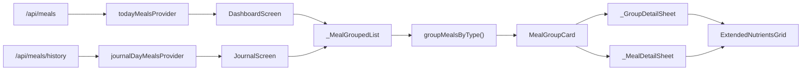

# HLD: Grouped Meals + Extended Nutrients — KayFit v7

## 1. Scope

**Входит:**
- Поле `mealType` + `dishName` в модели `Meal` (модель + freezed-геннерация)
- Логика группировки `List<Meal>` → `Map<String, List<Meal>>` (pure функция/extension)
- `MealGroupCard` адаптирован под v7 цвета (файл уже существует, нужна правка `dishName`)
- Замена плоского `SliverList<MealItem>` на `_MealGroupedList` в `dashboard_screen.dart`
- Та же группировка в `journal_screen.dart`
- `ExtendedNutrientsGrid` — переиспользуемый виджет плиток макросов (shared)
- `MealGroupCard._GroupDetailSheet` использует `ExtendedNutrientsGrid`

**Не входит:**
- Изменение API эндпоинтов
- Палитра AppColors / NutrientColors (не трогаем)
- Recognition sheet v2 (уже показывает расширенные нутриенты)
- Онбординг, авторизация, статистика

---

## 2. Компоненты

| Компонент | Файл | Ответственность |
|-----------|------|-----------------|
| `Meal` (расширение) | `lib/shared/models/meal.dart` | +`mealType`, +`dishName` с @JsonKey, +freezed regeneration |
| `MealGroupExtension` | `lib/shared/utils/meal_grouping.dart` | pure функция groupBy + сортировка групп |
| `MealGroupCard` | `lib/features/journal/widgets/meal_group_card.dart` | Уже существует — фикс `dishName`, адаптация к v7-цветам |
| `ExtendedNutrientsGrid` | `lib/shared/widgets/extended_nutrients_grid.dart` | Переиспользуемые плитки fiber/sugar/sat fat/micros |
| `_MealGroupedList` | приватный в `dashboard_screen.dart` | Группировка + рендер MealGroupCard со stagger-анимацией |
| `dashboard_screen.dart` | существующий | Замена SliverList → _MealGroupedList |
| `journal_screen.dart` | существующий | Замена ListView.builder → grouped view |

---

## 3. Диаграмма



---

## 4. Data-Flow: группировка

```
todayMealsProvider → List<Meal>
  ↓
groupMealsByType(meals) → Map<String, List<Meal>>
  (порядок: breakfast → lunch → snack → dinner → other)
  ↓
entries.map → MealGroupCard(mealType, meals)
  ↓
_GroupDetailSheet (агрегаты) → ExtendedNutrientsGrid
```

**Нужна ли модификация провайдера?** Нет. `todayMealsProvider` читает `/api/meals` — если бекенд уже отдаёт `meal_type` и `dish_name` в JSON (а он отдаёт, раз `add_meal_sheet` их сохраняет), достаточно добавить поля в модель `Meal` и перегенерировать freezed.

---

## 5. Изменения модели Meal

```dart
@freezed
class Meal with _$Meal {
  const factory Meal({
    // ... существующие поля ...
    @JsonKey(name: 'meal_type') String? mealType,   // NEW
    @JsonKey(name: 'dish_name') String? dishName,   // NEW
  }) = _Meal;
}
```

После: `dart run build_runner build --delete-conflicting-outputs`

---

## 6. Новый утилитарный файл: meal_grouping.dart

```dart
// lib/shared/utils/meal_grouping.dart

const _groupOrder = ['breakfast', 'lunch', 'snack', 'dinner'];

extension MealGrouping on List<Meal> {
  /// Возвращает упорядоченные записи Map<mealType, meals>.
  /// Приёмы без mealType складываются в группу 'other'.
  List<MapEntry<String, List<Meal>>> groupedByMealType() {
    final map = <String, List<Meal>>{};
    for (final meal in this) {
      final key = (meal.mealType?.isNotEmpty == true)
          ? meal.mealType!
          : 'other';
      map.putIfAbsent(key, () => []).add(meal);
    }
    // Сортировка по каноническому порядку, unknown-типы в конец
    return map.entries.toList()
      ..sort((a, b) {
        final ai = _groupOrder.indexOf(a.key);
        final bi = _groupOrder.indexOf(b.key);
        final an = ai < 0 ? 999 : ai;
        final bn = bi < 0 ? 999 : bi;
        return an.compareTo(bn);
      });
  }
}
```

---

## 7. ExtendedNutrientsGrid (новый shared виджет)

```dart
// lib/shared/widgets/extended_nutrients_grid.dart
class ExtendedNutrientsGrid extends StatelessWidget {
  final double? fiber;
  final double? netCarbs;
  final double? saturatedFat;
  final double? sugarAlcohols;
  // micros опциональны
  final double? sodium;   // г → конвертировать в мг при отображении
  final double? potassium;
  final double? vitaminC;
  // ...

  // Показывает только ненулевые поля в Wrap<_ExtendedChip>
  // Использует NutrientColors из app_theme.dart
}
```

Принимает отдельные `double?` поля — не весь `Meal`, чтобы работать и с агрегатами группы.

---

## 8. Задачи: разделение по сложности

### Вайбкодинг (механический, низкий риск)

| # | Задача | Файл |
|---|--------|------|
| 1 | Добавить `mealType`, `dishName` в `Meal` + regenerate | `meal.dart`, `meal.freezed.dart`, `meal.g.dart` |
| 2 | Создать `meal_grouping.dart` (pure extension) | `lib/shared/utils/meal_grouping.dart` |
| 3 | Создать `ExtendedNutrientsGrid` (копипорт `_ExtendedChip` из `meal_group_card.dart`, сделать публичным) | `lib/shared/widgets/extended_nutrients_grid.dart` |
| 4 | Пофиксить `meal_group_card.dart`: убрать `m.dishName ?? m.name` → добавить fallback (поле теперь есть в модели) | `meal_group_card.dart` |
| 5 | Заменить `_GroupDetailSheet` в `meal_group_card.dart` на использование `ExtendedNutrientsGrid` | `meal_group_card.dart` |
| 6 | Добавить `_MealGroupedList` в `dashboard_screen.dart` + подключить | `dashboard_screen.dart` |
| 7 | Добавить группировку в `journal_screen.dart` | `journal_screen.dart` |

### Про-разработчик (требует внимания)

| # | Задача | Почему сложно |
|---|--------|---------------|
| P1 | **Edge-case: mealType == null** | Старые записи в БД не имеют meal_type. Нужна политика: показывать как 'other', или плоским списком? Решить совместно с продуктом. |
| P2 | **Stagger-анимация для групп** | Текущий `_fadeFor(index)` в `dashboard_screen.dart` рассчитан под плоский список. При группах индекс — это номер группы, а не блюда. Нужно пересчитать Interval-кривые. |
| P3 | **Invalidate после delete внутри группы** | `onDeleteMeal` в `MealGroupCard` сейчас принимает `void Function(int id)?`. После удаления нужно инвалидировать `todayMealsProvider` — сигнал должен пройти от `MealGroupCard` → `dashboard_screen.dart` → `ref.invalidate`. Callback-цепочка без утечки контекста. |
| P4 | **Агрегация микронутриентов для группы** | sodium в `Meal` хранится в граммах (судя по `nutrientsFromMeal` в `meal_item.dart`: `meal.sodium! * 1000`), а `_GroupDetailSheet` будет суммировать их сырыми. Нужна единая утилита конвертации. |

---

## 9. Риски и edge-cases

| Риск | Описание | Митигация |
|------|----------|-----------|
| `mealType == null` у старых записей | Исторические данные из БД без поля | Группа 'other' с нейтральным заголовком «Другое / Other», не прячем |
| Пустая группа | Не возникнет — группа создаётся только если есть хотя бы один Meal | — |
| Дублирование `_ExtendedChip` | Один в `meal_group_card.dart`, второй в `meal_item.dart` (`_NutrientTile`) | `ExtendedNutrientsGrid` заменяет оба, оба файла используют его |
| `dishName == null` | AI может не вернуть `dish_name` | Fallback: `meal.dishName ?? meal.name` — уже в коде |
| freezed code-gen | После добавления полей в Meal нужен `build_runner` | Выполнить до начала UI-работ — блокирует компиляцию |
| Порядок групп | breakfast/lunch/snack/dinner — канонический, unknown в конец | Захардкожен в `_groupOrder` константе |

---

## 10. Порядок реализации (рекомендованный)

```
1. [ПРО] Meal модель: +mealType, +dishName → build_runner
2. [ВАЙБ] meal_grouping.dart
3. [ВАЙБ] ExtendedNutrientsGrid
4. [ВАЙБ] MealGroupCard: фикс dishName, подключить ExtendedNutrientsGrid
5. [ПРО] _MealGroupedList в dashboard_screen с корректной анимацией + invalidate
6. [ВАЙБ] journal_screen: та же группировка
7. [ПРО] Проверка edge-cases (null mealType, sodium unit, old records)
```
